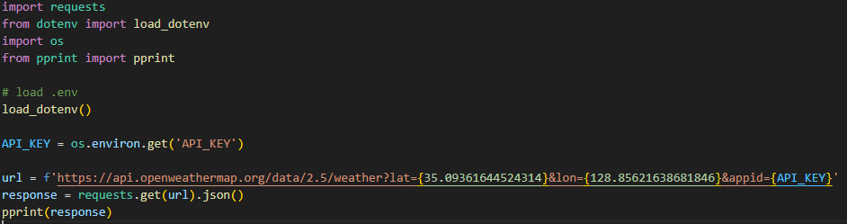
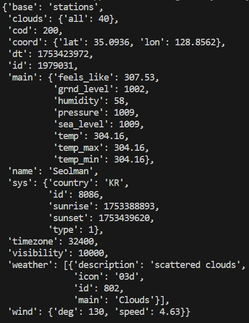
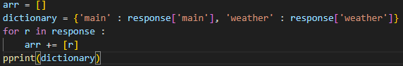
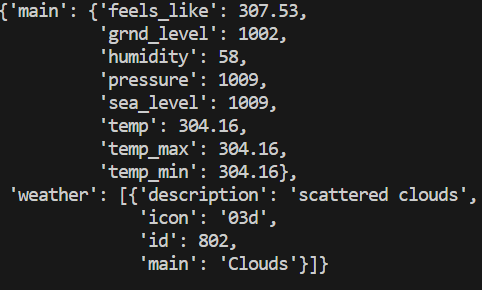
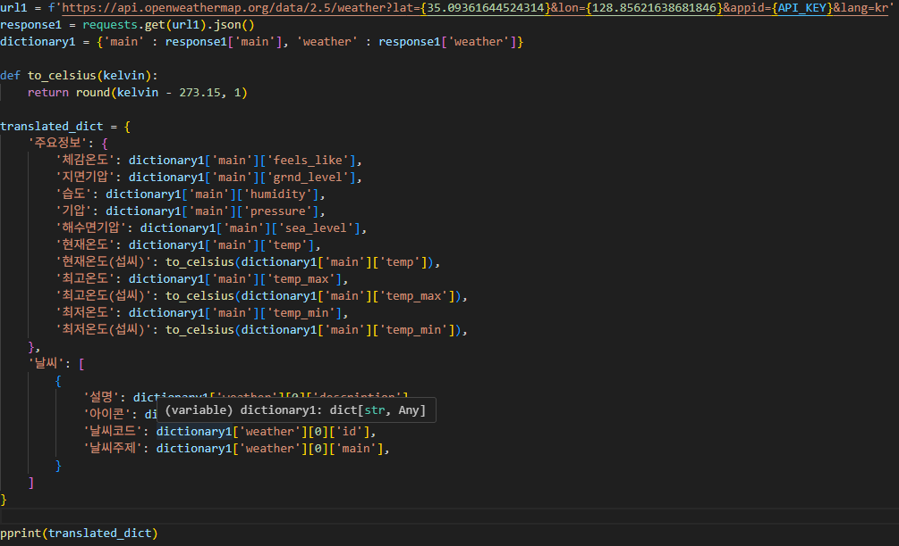
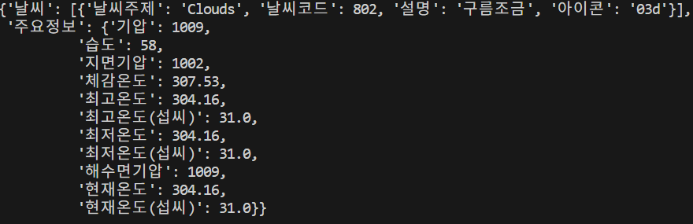

# f01 코드

# f01 콘솔

# f02 코드

# f02 콘솔

# f03, f04 코드

# f03, fo4 콜론

# 구현 설명 
### api_key의 경우 많이 중요하다고 강조된 만큼 보안에 신경 쓰고자 하여 방법을 인터넷에 검색하여 env 파일에 작성하여 import하고 gitignore 파일에 .env 파일을 작성하여 env 파일은 commit push되지 않는 방식으로 구현하였습니다.
### json 형태의 .text를 사용하면 파싱이 되지 않기에 .json()을 사용하여 딕셔너리로 키 값만을 출력하였습니다.
### 요구 사항과 일치하는 키로 새로운 딕셔너리를 키와 값이 일치하도록 새로운 딕셔너리를 생성하였습니다.
### api docs를 참고하여 lang의 kr을 사용하여 api를 요청하여 보았지만 키를 제외한 일부 값만 번역이 되어 번역을 한 딕셔너리를 생성하여 요구사항에 맞는 새로운 딕셔너리를 생성하였습니다.
### 딕셔너리의 온도 값이 총 3개가 있어 섭씨를 구하는 함수를 만들어 3개의 각각의 섭씨온도를 만들어 새로운 딕셔너리를 생성하였습니다.
### 텍스트 파일에 프롬프트와 질문예시 작성

# 학습 내용
### 공식문서 참고 방법, api의 사용법, 데이터 가공, ai 프롬프트 작성 요령 

# 느낀 점
### 경험만큼 좋은 스승은 없다고 생각합니다. api와 같은 경우 많이 사용할 것 같고 데이터 가공도 많이 할 것 같은데 좋은 경험이 된 것 같습니다. 