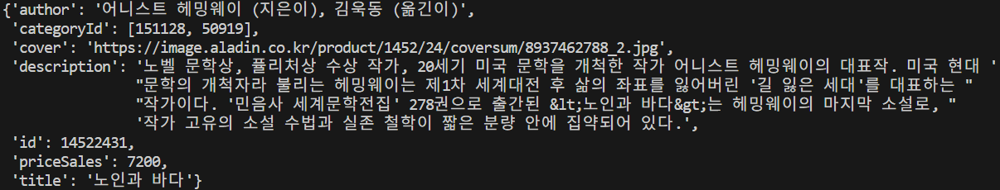

# f01_f02 코드

# f01_f02 콘솔

# f03 코드

# f03 콘솔

# f04_f05 코드

# f04_f05 콜론

# f06_f07 코드

# f06_f07 콜론

# f08 코드

# f08 콜론

# f11_f12 코드

# f11_f12 콜론

# f13 코드

# f13 콜론

# f14_f15 코드

# f14_f05 콜론

# f16_f17 코드

# f16_f17 콜론

# f18 코드

# f18 콜론

# 구현 설명 

# 학습 내용
### 공식문서 참고 방법, api의 사용법, 데이터 가공

# 느낀 점
### 반복문을 너무 많이 쓰면 시간 복잡도가 높아지는 것을 알고 있는데 반복문을 줄이면서 구현하는 방법을 더 고민해 봐야 할 것 같다.