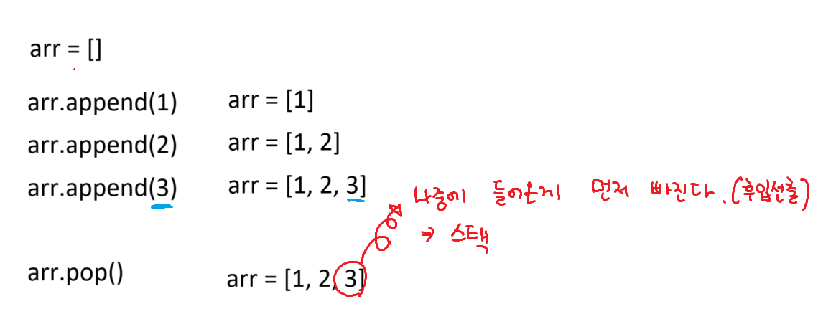

```python
arr = list(map(int, input().split()))

# 최대값 초기화(문제에서 음수가 input으로 없을 때는 0으로 초기화)
# max_v = 0
# 최대값의 범위가 문제에 주어지지 않을 때
max_v = float('-inf') # 음의 무한대
# min_v = float('inf') # 양의 무한대

for idx, value in enumerate(arr):
    # 최대값 코드
    if value > max_v:
        max_v = value # 최대값 갱신 되었을 때
        result = idx # 그 때의 인덱스

print(result)
```
# find 메서드
# 이론 2가지
# 1. str.find() : str에서 특정 문자나 문자열을 찾아주는 메서드
## 찾으면 첫 번째로 발견된 인덱스 반환, 못찾으면 -1
# 2. str.find('a', n) 
## : n번째 인덱스부터 시작해서 'a' 문자를 찾아라

```python
text = 'B[45]AB[2234]'
start1 = text.find('[')
end1 = text.find(']', start1 + 1)
start2 = text.find('[', end1 + 1)
end2 = text.find(']', start2 + 1)
```

# stack


# queue


```python
# result = []
# arr = [0] * 5
# for _ in range(5):
#     result.append(arr)

# 파이써닉하다(파이썬스러우면서 코드가 간결하다)
arr = [[0] * 5 for _ in range(5)]

print(arr)

# 2차원 배열 입력(n행)
n = int(input())
arr = [list(map(int, input().split())) for _ in range(n)]
```