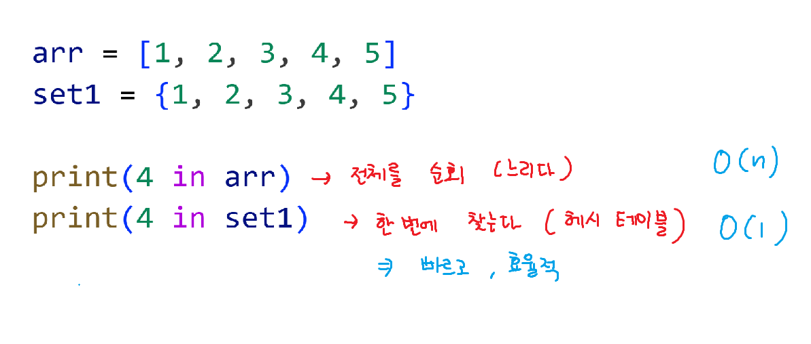

# 딕셔너리 메서드:
keys(): 딕셔너리의 키들을 모은 뷰 객체를 반환합니다. 

values(): 딕셔너리의 값들을 모은 뷰 객체를 반환합니다. 

items(): 딕셔너리의 키-값 쌍을 튜플 형태로 반환합니다. 

get(key[, default]): 키에 해당하는 값을 반환합니다. 키가 없으면 default 값을 반환하거나, None을 반환합니다. 

update(other): 다른 딕셔너리 또는 키-값 쌍을 현재 딕셔너리에 추가하거나 업데이트합니다. 

pop(key[, default]): 키에 해당하는 값을 제거하고 반환합니다. 키가 없으면 default 값을 반환하거나, KeyError를 발생시킵니다. 

popitem(): 임의의 키-값 쌍을 제거하고 튜플 형태로 반환합니다. 딕셔너리가 비어있으면 KeyError를 발생시킵니다. 

clear(): 딕셔너리의 모든 항목을 제거합니다. 

# 세트 메서드:
add(element): 세트에 요소를 추가합니다.

update(other): 다른 세트 또는 반복 가능한 객체의 요소를 세트에 추가합니다.

remove(element): 세트에서 요소를 제거합니다. 요소가 없으면 KeyError를 발생시킵니다.

discard(element): 세트에서 요소를 제거합니다. 요소가 없어도 에러를 발생시키지 않습니다.

pop(): 임의의 요소를 제거하고 반환합니다. 세트가 비어있으면 KeyError를 발생시킵니다.

clear(): 세트의 모든 요소를 제거합니다.

union(other): 두 세트의 합집합을 반환합니다.

intersection(other): 두 세트의 교집합을 반환합니다.

difference(other): 두 세트의 차집합 (자기 세트에만 있는 요소)을 반환합니다.

symmetric_difference(other): 두 세트의 대칭 차집합 (두 세트에 각각만 있는 요소)을 반환합니다.

issubset(other): 현재 세트가 다른 세트의 부분집합인지 확인합니다.

issuperset(other): 현재 세트가 다른 세트의 상위집합인지 확인합니다.

copy(): 세트의 복사본을 반환합니다. 

# 세트
```
seen = {1, 6, 3, 5, 'B', 9, 999, -10, -3, 'A'}

a = seen.pop()
print(a)
a = seen.pop()
print(a)
a = seen.pop()
print(a)
a = seen.pop()
print(a)
a = seen.pop()
print(a)
a = seen.pop()
print(a)
a = seen.pop()
print(a)
a = seen.pop()
print(a)
```

# 해시테이블!!
이로 인해 매우 빠름

# Q) 이 소스코드를 실행할 때마다 결과가 다를까? 같을까?
# A) 정수의 해시값은 일정하기 때문에 결과가 같다

# Q) pop을 했을때 작은값 먼저 제거하고 반환 ???
# A) X

# Q) 세트의 요소에 문자가 있을 때도 실행할 때마다 결과가 같을까? 다를까?
# A) 정수의 해시값은 일정하고, 문자의 해시값은 일정하지 않다.

