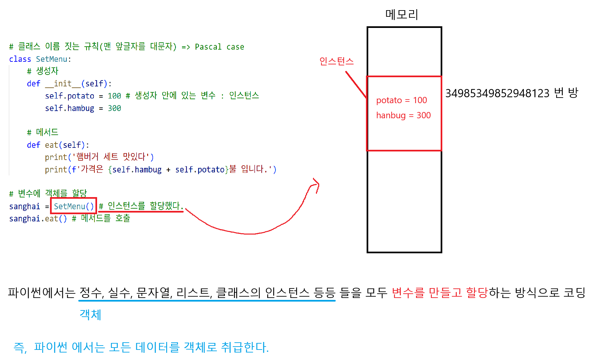

# 프로그래밍 패러다임
절차지향과 객체지향은 대조되는 개념이 아니다
보완하기 위해 객라는 개념을 도입해 상속, 코드 재사용성, 유지보수성 이점 가진 패러다임

# 절차 지향
변수와 함수를 별개로 다룸
함수가 메인

## 특징

### 함수 호출의 흐름이 중요

### 데이터를 다시 재사용하기보다는 처음부터 끝가지 실행되는 결과물이 중요

## 한계

### 복잡성 증가
프로그램 규모가 커질수록 데이터와 함수의 관리가 어려움

### 유지보수 문제

# 객체 지향
데이터가 메인
데이터와 메서드의 결합
함수(데이터) -> 데이터.메서드

## 클래스
설계도
하나의 구조 안에 데이터(변수)와 기능(함수)을 함께 정의하는 도구
공통된 특성과 기능을 가진 틀을 만드는 것  -> 새로운 타입을 만드는 행위

## 인스턴스
실제 물건
서로 독립적인 데이터를 가질 수 있다
클래스를 통해 생성된 객체

### 메서드 구조
반드시 첫번째 인자로 인스턴스 자신(self)을 받음, 다른 이름 사용하지 않을 것을 강력히 권장
인스턴스의 속성에 접근하거나 변경 가능

## 객체
속성(변수)과 동작(매서드)을 가짐
고유성, 독립적

