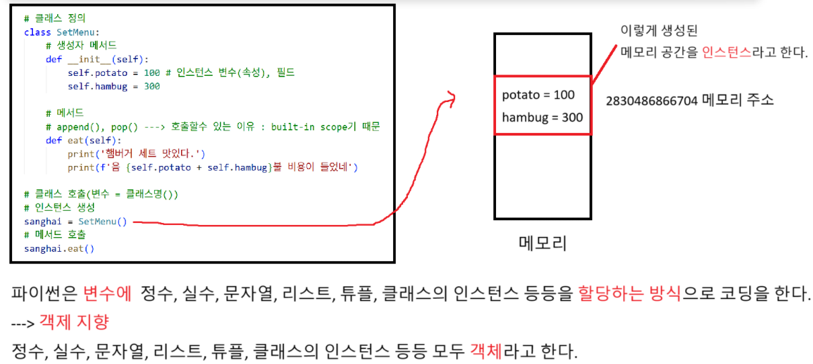

# 클래스

### 변수는 단순히 객체의 이름표일 뿐
```
a = 3 # 할당
b = [1, 2, 3, 4, 5] # 할당
c = SetMenu() # 할당
a = 15 # 재할당
b[3] = 2 # 할당 X
a = SetMenu() # 재할당

# Q) c에 할당된 SetMenu()와 a에 할당된 SetMenu()는 서로 같은 객체? 다른 객체?
# A) 서로 다른 객체
# ex) 메이플 스토리 캐릭터 생성 렌 하나 생성, 렌 하나더 생성 : 서로 다른 캐릭터
# Q) 할당 횟수는?
# A) 5번
# Q) 객체는 총 몇개?
# A) 11개

# 엄밀한 기준 (새로 생성된 객체만): 8개
# 조금 느슨하게 생각 (중복 포함): 9~10개
# 완전히 중복 포함 + 모든 숫자 객체를 별개로 셈: 11개 (정확한 기준 없이 단순히 등장 횟수로 센 경우)

```


# 매직 메서드, 클래스 메서드, 스태틱 메서드 정리
```
class Calculator:
    pi = 3.141592 # 클래스 변수

    # 생성자
    def __init__(self, name):
        self.name = name # 인스턴스 변수

    # 메서드
    def add(self, a, b):
        return a + b
    
    # 매직 메서드 --> 객체를 문자열로 표현할때 호출됨
    def __str__(self):
        return f'Calculator name : {self.name}'
    
    # 클래스 메서드 --> 클래스 자체를 첫번째 인자로 받는다
    @classmethod
    def get_pi(cls):
        return f'파이 값은 {cls.pi}'
    
    # 스태틱 메서드 --> self나 cls가 없음, 독립적으로 실행 가능
    @staticmethod
    def multiply(a, b):
        return a * b

# 인스턴스 생성
calc = Calculator("공학용계산기")
# 메서드 호출
print(calc.add(2, 3))
# 매직 메서드 호출 - 인스턴스를 할당한 변수만 작성
print(calc)
# 클래스 메서드 호출 - 클래스로 직접 호출
print(Calculator.get_pi())
# 스태틱 메서드 호출 - 클래스로 호출도 가능, 인스턴스로 호출도 가능
print(Calculator.multiply(4, 5))
print(calc.multiply(4, 5))
```

'''
# 상속으로 할수있는것 2가지(부모 메서드 교체, 새로운 메서드 추가)
# 1. 오버라이딩

# 부모클래스
class Person:
    def walk(self):
        print('사람이 걷는다')

# 자식클래스
class SuperMan(Person):
    def fly(self):
        print('슈퍼맨이 난다')

    def walk(self): # 오버라이딩 == 메서드를 재정의 한다.(목적 : 부모 메서드를 교체)
        print('슈퍼맨이 뚜벅뚜벅 걷는다.')

a = SuperMan() # 인스턴스 생성
# 자식클래스의 인스턴스를 생성해도 부모클래스의 메서드 호출이 가능
a.walk() # 메서드 호출
a.fly()


'''


# EAFP(try-except 구조)
# - IndexError
'''
def get_v(arr, idx):
    try:
        return arr[idx]
    except IndexError:
        return -1 # 인덱스 범위를 벗어난 경우

arr = [1, 2, 3]
result = get_v(arr, 5)
print(result)
'''


# LBYL(if-else 구조)
'''
def get_v(arr, idx):
    if 0 <= idx <= len(arr) - 1:
        return arr[idx]
    return -1

arr = [1, 2, 3]
result = get_v(arr, 5)
print(result)
'''
