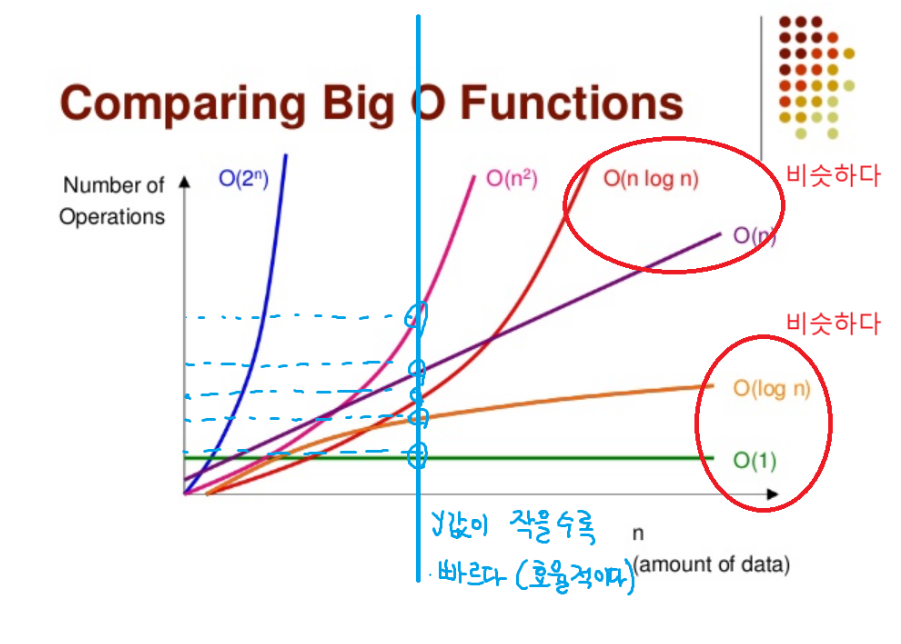

연속된 메모리를 사용하는 배열 변수 -> 의미가 있음

num0 =0, num1 = 1, num2 = 2, arr_num = [0, 1, 2]

파이썬에서는 배열의 길이가 3이라도 메모리에 3 이상으로 자리를 잡는다

append, pop는 많이 사용하면 효율이 떨어짐 -> 크기가 n인 배열을 미리 만들어 두는게 좋음

비교하는 코드와 연산 코드의 순서를 맞추는 것이 가독성이 더 좋다.

그림과 슈도 코드를 미리 적어 두고 연습
슈도코드를 코드로 바꾸는 연습

