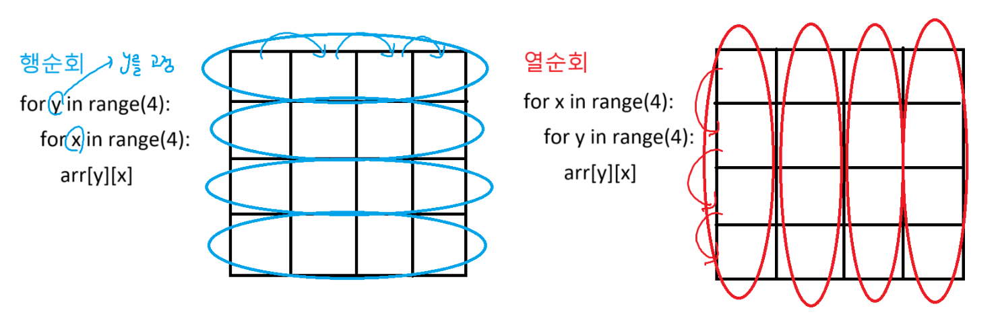
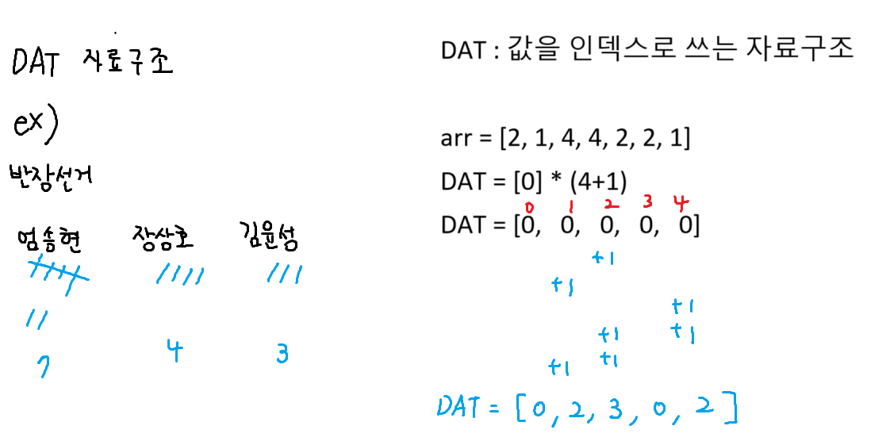

# 리스트 컴프리헨션 복습

```
[0, 0, 0, 0] == [0 for _ in range(4)]
```

2차원 이상 리스트는 리스트 컴프리헨션 무조건 사용하도록 하자
람다와는 다름 람다는 1회성 함수를 사용하기 위해서 사용함

# 탐색 <---> 완전탐색

## 탐색

내가 원하는 것을 찾는 것(특정 값, 조건을 만족하는)

## 완전 탐색(브루트포스 알고리즘)

모든 경우를 전부 확인하는 것(재귀)

# 행순회, 열순회



# DAT(Direct Address Table)



# 디버깅

1. 중단점(breaking point) 찍기
   : 함수호출하는 부분, 내가 세세히 알고싶은 부분

2. Debug 'main' : 단축키 F5

3. step into는 함수 안으로 들어가기 : F11
   step over는 다음단계 진행 : F10

4. 중간에 정지하고싶으면 빨간색 네모버튼 누르면 된다.

# 왜 갑자기 완전 검색과 그리디가 나왔을까 ?

List-1

- 지금은 문제에서 특별한 알고리즘을 다뤄보자! 라기 보단
  구현을 잘해보자. list, dictionary 이런 기본 자료구조를 잘 활용해보자

앞으로 많은 알고리즘들을 배우게 된다.

- 문제를보고 "어떤 알고리즘을 쓰면 되겠구나!" 를 알아야 한다.
  - 선택하는 과정에서 어느 정도 고민하는 순서가 있음

1. 완전 검색 (brute force)

- 나올 수 있는 모든 경우를 다 보자
- 동전 거스름돈: 500원, 100원, 50원, 10원
  - 3200원을 최소한의 동전 갯수로 만들어보자.
    - 500원 1개 + 100원 27개
    - 500원 1개 + 100원 26개 + 50원 2개
    - 500원 1개 + 100원 26개 + 50원 1개 + 10원
      .....

-> 너무 느리다 (규칙을 찾는 것 보다 훨씬 느리다)
------------------ 완전 검색이 안되네 ???
시간 복잡도, 공간 복잡도 계산

- Python 기준 1초 당 3,000만 번 연산이 가능

2. 숨겨져 있는 규칙은 없을까? (그리디)

- 현재 단계에서 제일 좋은 것만 골랐을 때, 최종적으로 정답이 나오는 알고리즘
- 동전 거스름돈: 500원, 100원, 50원, 10원
  - 최소한의 몫 = 큰 수로 나누어야 한다.
  - 값이 큰 동전부터 사용하면, 최소 동전으로 거슬러 줄 수 있구나!

180원, 240원, 10원 동전 -> 그리디로 못푼다. (최소 규칙이 적용 X)

- 반례: 360원

---------------- 규칙으로 안된다면

3. 동적 프로그래밍 (DP: Dynamic Programming)

- 나중에 학습하게 됩니다!

# 파일에서 입력받기

import sys

- 입력을 콘솔로 받던걸 input.txt 파일에서 가져오겠다.
  sys.stdin = open("input.txt")
