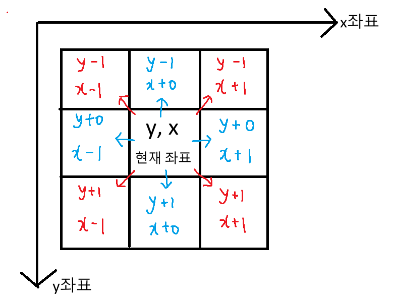
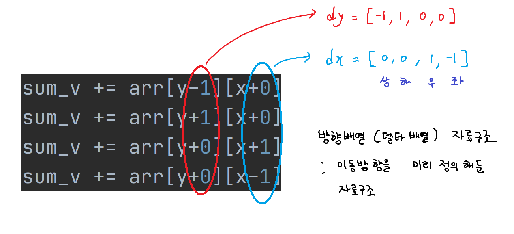

`arr = [[0] * 4] * 3`가 더 간단해 보이지만, **파이썬에서는 버그를 유발할 수 있는 위험한 코드**이다.

---

### 🔁 1. `arr = [[0] * 4] * 3` — 위험한 코드

이 코드는 다음과 같이 작동한다:

- `[0] * 4` → `[0, 0, 0, 0]`
- `[[0, 0, 0, 0]] * 3` → **같은 리스트 객체를 3번 복제 (얕은 복사)**

즉, `arr[0]`, `arr[1]`, `arr[2]`는 모두 **같은 리스트를 가리킨다 (동일한 객체)**.

```python
arr = [[0] * 4] * 3
arr[0][0] = 1
print(arr)
```

🔽 출력 결과:

```python
[[1, 0, 0, 0],
 [1, 0, 0, 0],
 [1, 0, 0, 0]]
```

모든 행이 동시에 바뀜 → 왜냐하면 **같은 리스트이기 때문에**

---

### ✅ 2. `arr = [[0] * 4 for _ in range(3)]` — 올바른 코드

이 코드는 리스트 컴프리헨션으로 **각 행마다 새로운 리스트를 생성**한다.

```python
arr = [[0] * 4 for _ in range(3)]
arr[0][0] = 1
print(arr)
```

🔽 출력 결과:

```python
[[1, 0, 0, 0],
 [0, 0, 0, 0],
 [0, 0, 0, 0]]
```

각 행이 독립적이기 때문에, 원하는 행만 수정할 수 있다.

---

### ✅ 결론

| 표현식                        | 의미                          | 안전성  |
| ----------------------------- | ----------------------------- | ------- |
| `[[0] * 4] * 3`               | **같은 리스트**를 3번 반복    | ❌ 위험 |
| `[[0] * 4 for _ in range(3)]` | **서로 다른 리스트** 3개 생성 | ✅ 안전 |

**따라서, 2차원 배열 초기화는 리스트 컴프리헨션을 쓰는 것이 훨씬 더 안전하다.**
(비슷해 보여도 동작은 완전히 달라요.)

---

`id(arr[0])`, `id(arr[1])` 이렇게 찍어서 객체 주소를 확인해봐도 좋음

# 좌표



# 방향 배열 자료구조



# 조건 추가


# 변수 위치

구하고 싶은 값을 변수로 지정해서 초기화

제어문 밖에 작성

범위 밖으로 나가는지 안 나가는지 체크

## 예시 코드

### max_total과 total

```PYTHON
# 1. 이차원 리스트 각 좌표가 모두 파리채를 때리는 좌표가 될 수 있다
# 2. 현재 좌표 + 상하좌우 값이 가장 큰 좌표를 찾자.


# 상하좌우 (좌표의 변화량만 저장한 델타 배열 == 방향배열 이라고도 함))
dy = [-1, 1, 0, 0]
dx = [0, 0, -1, 1]

T = int(input())

for tc in range(1, T + 1):
    N = int(input())  # 맵 사이즈 (이차원 리스트의 크기)
    arr = [list(map(int, input().split())) for _ in range(N)]

    max_total = 0
    result_y, result_x = 0, 0

    # 모든 좌표를 확인하면서
    for y in range(N):
        for x in range(N):
            # 현재좌표값 + 상하좌우값 -> max 값을 찾자
            total = arr[y][x]
            for i in range(4):
                ny = y + dy[i]
                nx = x + dx[i]

                # ny, nx가 범위 밖으로 나가면 해당 방향은 계산 X
                if ny < 0 or ny >= N or nx < 0 or nx >= N:
                    continue

                total += arr[ny][nx]  # 범위 안의 값은 더해준다

            # 최대값 비교
            if total > max_total:
                max_total = total
                result_y = y
                result_x = x

    print(f'#{tc} {max_total} {result_y} {result_x}')
```
