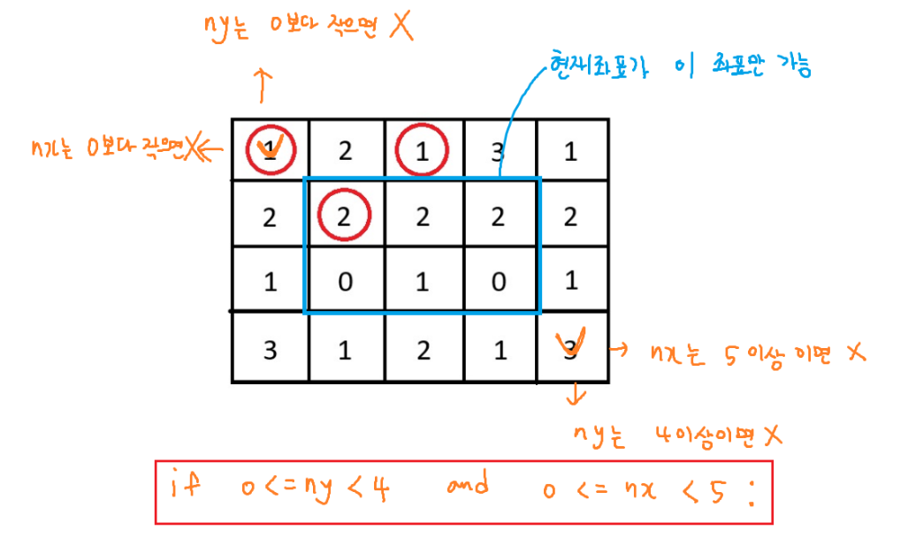

`arr = [[0] * 4] * 3`가 더 간단해 보이지만, **파이썬에서는 버그를 유발할 수 있는 위험한 코드**이다.

---

### 🔁 1. `arr = [[0] * 4] * 3` — 위험한 코드

이 코드는 다음과 같이 작동한다:

* `[0] * 4` → `[0, 0, 0, 0]`
* `[[0, 0, 0, 0]] * 3` → **같은 리스트 객체를 3번 복제 (얕은 복사)**

즉, `arr[0]`, `arr[1]`, `arr[2]`는 모두 **같은 리스트를 가리킨다 (동일한 객체)**.

```python
arr = [[0] * 4] * 3
arr[0][0] = 1
print(arr)
```

🔽 출력 결과:

```python
[[1, 0, 0, 0],
 [1, 0, 0, 0],
 [1, 0, 0, 0]]
```

모든 행이 동시에 바뀜 → 왜냐하면 **같은 리스트이기 때문에**

---

### ✅ 2. `arr = [[0] * 4 for _ in range(3)]` — 올바른 코드

이 코드는 리스트 컴프리헨션으로 **각 행마다 새로운 리스트를 생성**한다.

```python
arr = [[0] * 4 for _ in range(3)]
arr[0][0] = 1
print(arr)
```

🔽 출력 결과:

```python
[[1, 0, 0, 0],
 [0, 0, 0, 0],
 [0, 0, 0, 0]]
```

각 행이 독립적이기 때문에, 원하는 행만 수정할 수 있다.

---

### ✅ 결론

| 표현식                           | 의미                  | 안전성  |
| ----------------------------- | ------------------- | ---- |
| `[[0] * 4] * 3`               | **같은 리스트**를 3번 반복   | ❌ 위험 |
| `[[0] * 4 for _ in range(3)]` | **서로 다른 리스트** 3개 생성 | ✅ 안전 |

**따라서, 2차원 배열 초기화는 리스트 컴프리헨션을 쓰는 것이 훨씬 더 안전하다.**
(비슷해 보여도 동작은 완전히 달라요.)

---
`id(arr[0])`, `id(arr[1])` 이렇게 찍어서 객체 주소를 확인해봐도 좋음

# 좌표


# 방향 배열 자료구조


# 조건 추가
