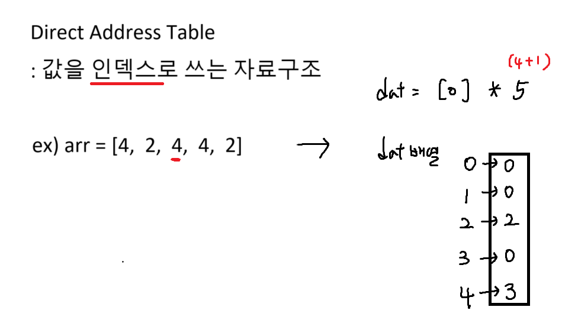
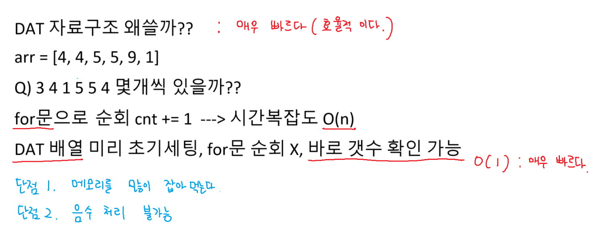

알고리즘 : 자료구조를 암기하고 -> 활용x
우리가 배운 범위 안에서 얼마나 잘 구현할 수 있는지
for문을 어떻게 잘 돌리는지
조건문을 어떻게 잘 쓰는지
while문, 반복문 어떻게 잘 쓰는지
글에 적힌 내용을 코드로 어떻게 구현하는지

# 부분집합
재귀호출 -> 백트래킹 -> 순열, 조합, 부분집합

부분집합은 반드시 재귀로만 가능하지 않다 비트연산으로도 가능하다
순열, 조합은 안 됨

# 이진 탐색

# 선택 정렬

# 만약 값이 string이면 인덱스로 어떻게 쓸까??
## A) 아스키코드로 변환

# DAT

