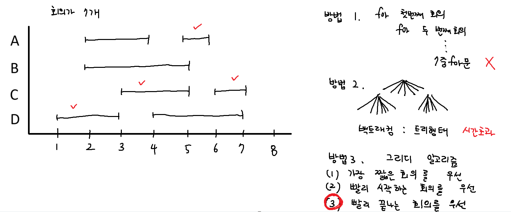
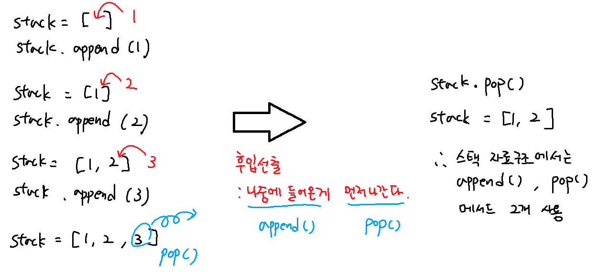
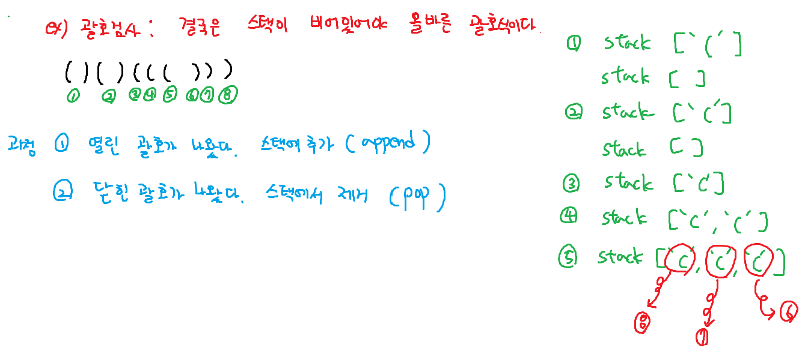

# 22311. 회의실 배정

# stack

# 괄호검사, 후입 선출

## 광호검사 예제코드
```python
def is_brakets(text):
    stack = []

    for char in text:
        if char == '(': # 여는 괄호면 스택에 추가
            stack.append(char)
        elif char == ')': # 닫는 괄호면
            if not stack: # 스택이 비어있으면 실패
                return False
            stack.pop() # (스택이 비어있지 않으면) 스택에서 여는 괄호 제거

    return len(stack) == 0 # 최종적으로 스택이 비어있어야 올바른 괄호

# 하드코딩
arr = [
    "()()((()))",
    "((()))()()((()))(()"
]
for text in arr:
    if is_brakets(text): print(f'{text}는 올바른 괄호식')
    else: print(f'{text}는 올바르지 않은 괄호식')
```
