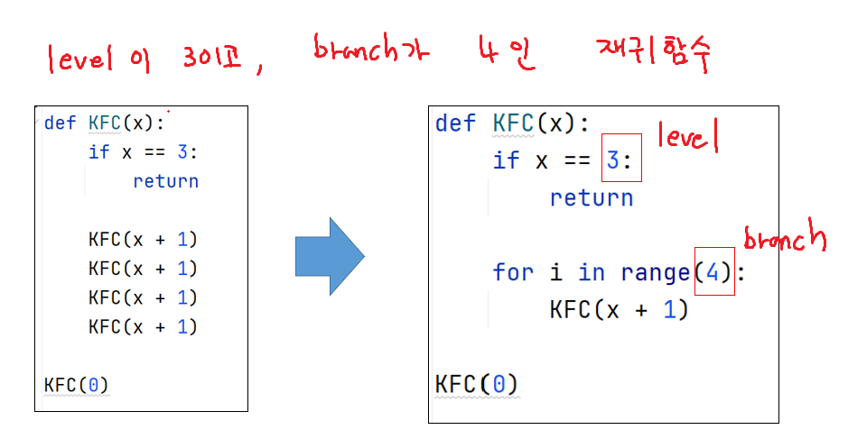

# 후위표기법 전략

전략
피연산자(숫자)는 스택에 추가(append)
연산자를 만나면 스택에서 두개의 숫자를 pop해서 계산
(만약 스택에 2개의 숫자가 없다면 error)
계산결과를 다시 스택에 추가(append)
마지막 '.' 종료, 스택에 딱 하나의 결과값만 있어야함

ex)
"1 2 + 3 *."

1. '1' -> 스택에 추가 : stack = [1]
2. '2' -> 스택에 추가 : stack = [1, 2]
3. '+' -> 2, 1 pop해서 계산 후 스택에 추가 append -> stack = [3]
4. '3' -> 스택에 추가 : stack = [3, 3]
5. '*' -> 3, 3 pop해서 계산 후 스택에 추가 append -> stack = [9]
6. '.' -> 종료, 결과를 반환 return stack[0] == 9
 
## code
```python
def get_caculate(arr):
    stack = []
    for i in arr[:-1]: # 마지막을 element를 제외하고 순회
        if i.isdecimal(): # 피연산자면 스택에 넣기
            stack.append(int(i))
        elif i in {'+', '-', '*', '/'}: # 연산자면
            if len(stack) < 2: # pop을 해야되는데 2개 미만이면
                return 'error'
            b = stack.pop()
            a = stack.pop()
            if i == '+': stack.append(a + b) # 계산해서 다시 스택에 넣기
            elif i == '-': stack.append(a - b)
            elif i == '*': stack.append(a * b)
            elif i == '/': stack.append(a // b)
    if len(stack) != 1:
        return 'error'
    return stack[0] # stack에 정수가 1개 있을 떄

T = int(input())
for tc in range(1, T + 1):
    Forth = input().split()
    result = get_caculate(Forth)
    print(f'#{tc} {result}')
```

# 재귀호출
## 재귀함수의 필요성

## 함수에서의 변수의 특성

## 재귀 변수 출력

## 트리 형태

## 재귀함수 순서

## 레벨, 깊이

## 레벨, 브랜치


# 삼각함수

## 코사인법칙

## r 구하는 방법
