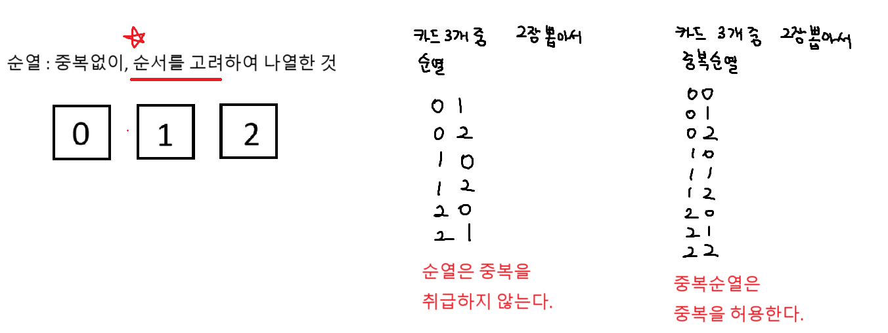
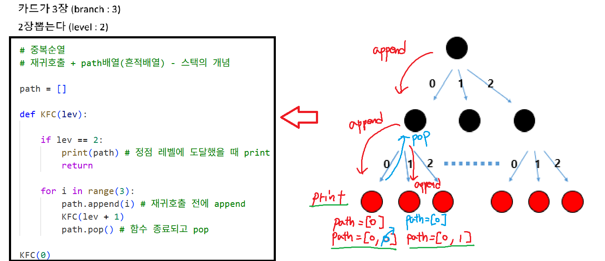
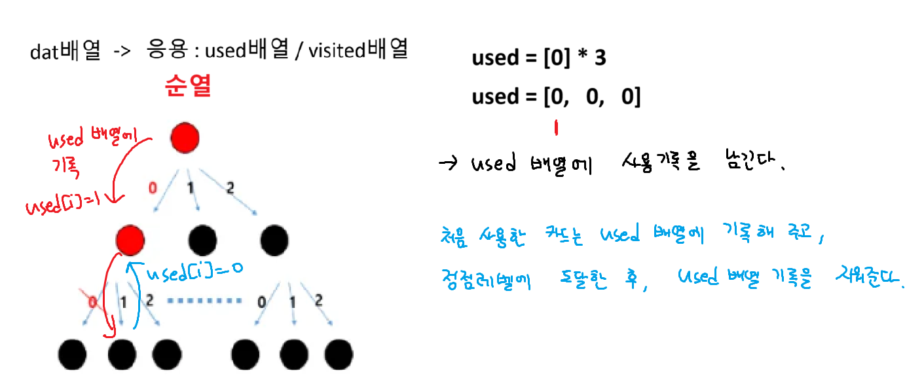
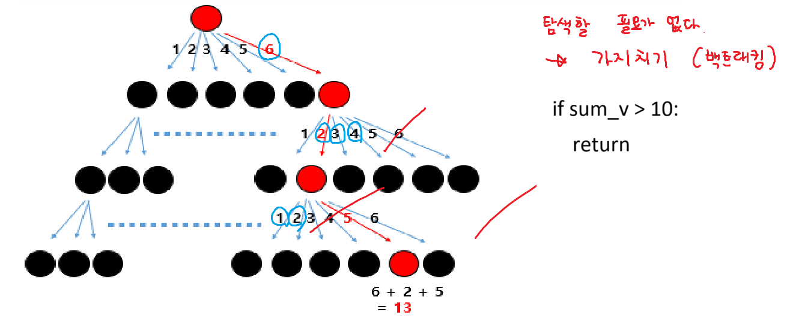
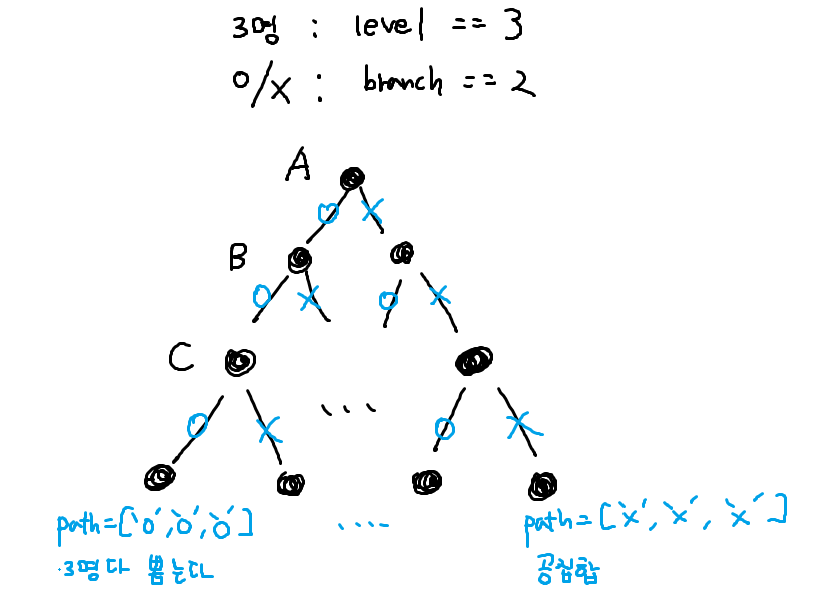
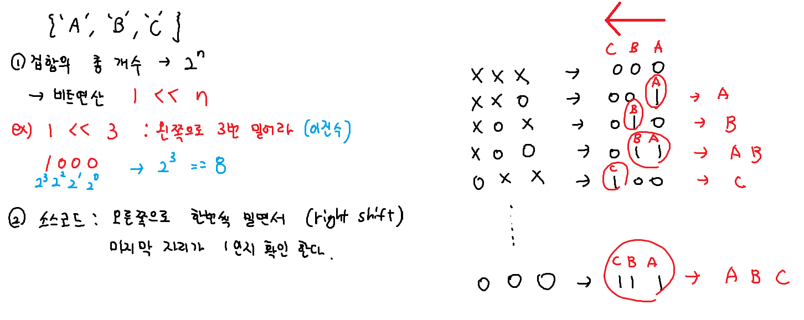
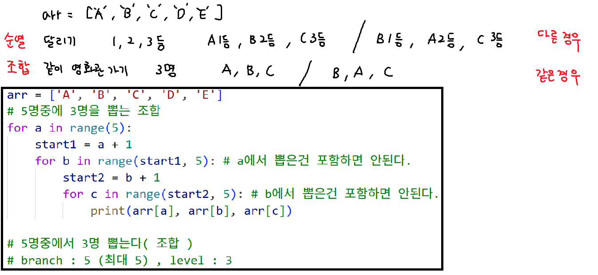
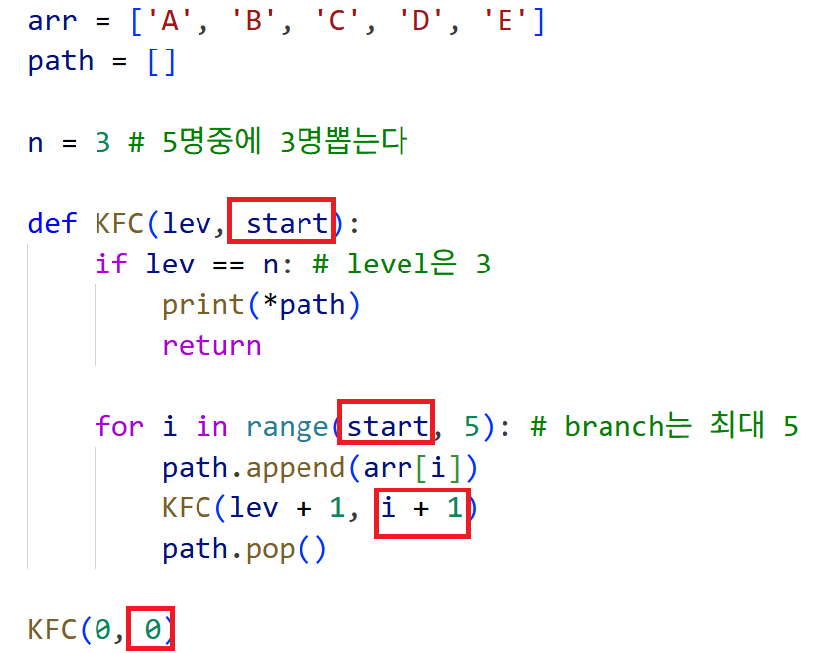

# 순열, 중복 순열


## 중복순열


## 순열


### 순열 코드
```python
path = []
used = [0] * 7

def KFC(lev):
    if lev == 3: # 주사위 3개 던진다.
        print(*path)
        return

    for i in range(1, 7): # 주사위 눈금이 1~6까지 (branch 6)

        # 만약 used배열에 기록이 되어있으면
        # 재귀 호출 하지않는다 : 다음 레벨로 탐색하지 않는다
        if used[i] == 1: continue
        used[i] = 1 # 기록
        path.append(i)
        KFC(lev + 1)
        path.pop()
        used[i] = 0 # 지워준다

KFC(0)
```

## 가지치기
``` python
    # 가지치기(백트래킹) - 합계가 10보다 크면 탐색자체를 안한다.
    if sum_v > 10:
        return
    
    if lev == 3: # 주사위 n개 던진다.
        # 합계가 10 이하 일때 합계 출력
        # 느리다. (탐색할 필요가 없다)
        if sum_v <= 10:
            print(sum_v)
        return
```


## 부분집합


### 부분집합 코드
``` python
arr =['O', 'X']
path = []
def kfc(lev):
    if lev == 3: # level: 3
        print_name() # 함수호출(이름출력)
        return
    for i in range(2): # branch: 2
        path.append(arr[i])
        kfc(lev + 1)
        path.pop()
```

# 비트연산

## 부분집합 비트연산 기본 코드
```python
arr = ['A', 'B', 'C']
n = len(arr)
# 0b110 (이진수) -> 6 (십진수)

def get_sub(tar):
    for i in range(n):
        # if tar & 1: -> 0x1 가독성 : 이 연산은 비트연산입니다.
        if tar & 0x1: # 마지막 자리가 1인지 확인
            print(arr[i], end = ' ')
        tar >>= 1 # 오른쪽으로 한번씩 민다.

for tar in range(1 << n): # 2의 n제곱
    # 0부터 7까지 (000, 001, 010, 011, 100, 101, 110, 111)
    print('{', end = ' ')
    get_sub(tar)
    print('}')
```


# 조합

## 기본 조합 코드
