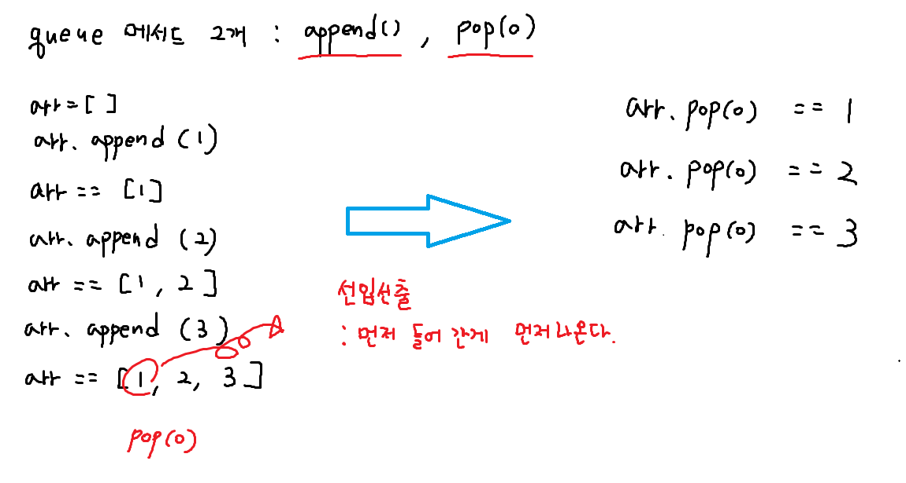
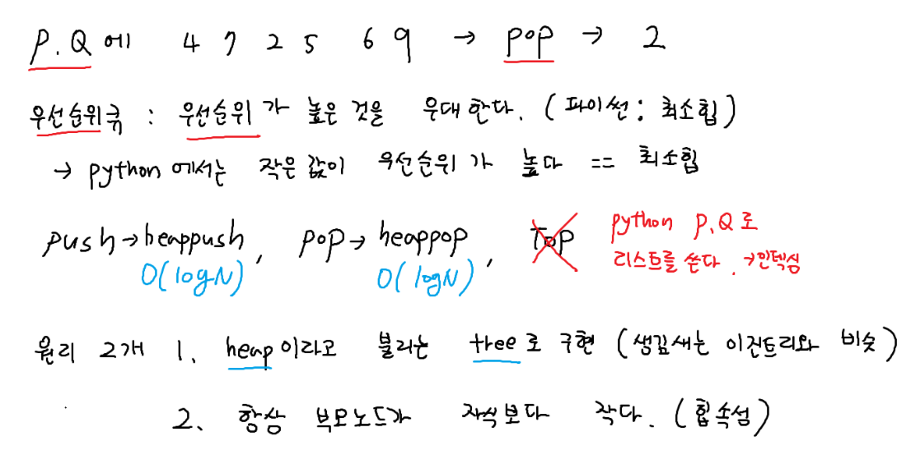
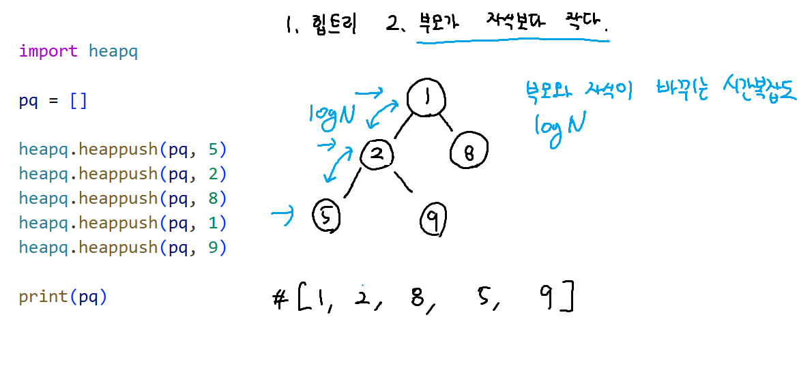
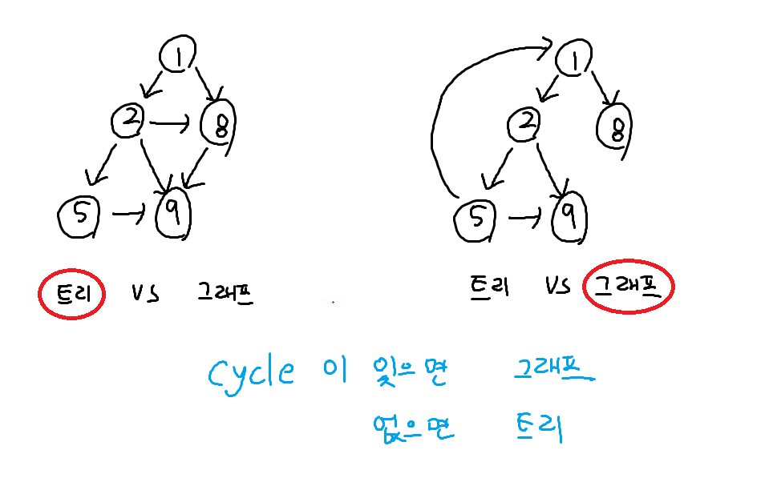
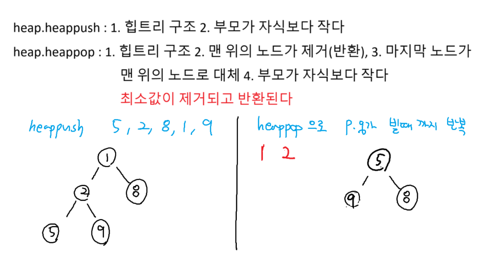

-stack이 단독으로 쓰이는 문제는 없다.
-재귀(정점 레벨(노드)까지 탐색->DFS)

-Queue는 정말정말 중요하다.
ㄴQueue를 응용한 BFS(너비우선탐색)

ㄴ우선순위큐(Priority Queue)(PQ) - 파이썬은 최소 힙
ㄴBFS + P.Q => 다익스트라

-DFS와 BFS 알고리즘을 쓰려면 트리/그래프 자료구조에서 써야 한다.
-> 트리의 종류
-> 트리와 그래프의 차이
-> 그래프의 종류 (단방향 양방향)

# queue


## 덱과 리스트의 시간복잡도


덱과 리스트는 다르다.
### 덱의 popleft 동작의 개념적 흐름

* **덱 내부에 각 값들이 저장되어 있고**
* 덱은 “지금 이 덱의 **시작 위치**는 여기야” 라는 **포인터**를 가지고 있다.

```
pointer ➝ A   B   C   D
           0   1   2   3
```

* `popleft()` 를 호출하면

  * **pointer가 +1 증가**
  * 즉, **A는 더 이상 “0번째”라고 가리키지 않음**

```
pointer ➝ B   C   D
          (이제 B가 0번째가 된 것처럼 보임)
```

### 따라서

> **0번째 값(A)는 포인터가 지나가면서 “배열에서 빠진 것처럼” 되고,**
> **기존 1번째 값(B)의 포인터가 0번째를 가리키게 된다.**

# priority_queue


# heap.heappush (heap tree 구조)


# tree & graph


# heap.heappop


```python
import heapq

pq = []
heapq.heappush(pq, 5)
heapq.heappush(pq, 2)
heapq.heappush(pq, 8)
heapq.heappush(pq, 1)
heapq.heappush(pq, 9)

print(pq) # [1, 2, 8, 5, 9] # 힙 트리

sorted_arr = []

while pq: # pq가 빌때까지 반복 -> heap sort
    sorted_arr.append(heapq.heappop(pq))

print(sorted_arr) 
```