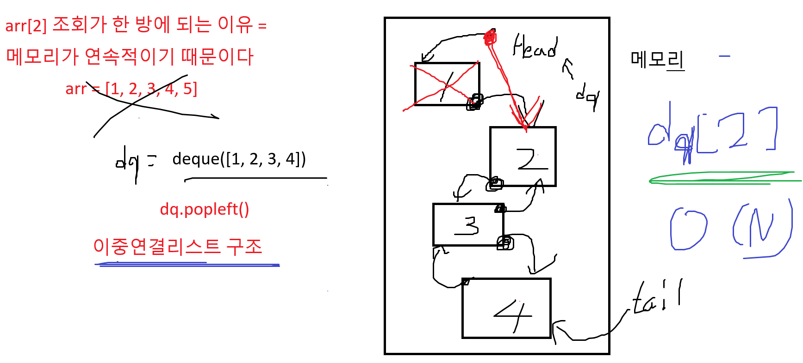

# deque 기초

```python
# 일반 리스트
li = [1, 2, 3, 4, 5]

print(li.pop(0))    # 제일 앞에 데이터를 제거하면, 한 칸 씩 모두 당겨야 한다.
                    # --> O(N) 만큼 시간이 발생

# 데이터를 앞/뒤 에서 추가 삭제가 빈번하다면, 무조건 deque 이 유리
#  - 중간 데이터를 활용해야 한다면, 불리
from collections import deque

dq = deque((1, 2))  # 반복 가능한 객체를 통해서 deque 을 생성

dq.append(3)        # 뒤에 삽입
dq.appendleft(4)    # 앞에 삽입
print(dq)

print(dq.pop())         # 뒤에 데이터 제거
print(dq.popleft())     # 앞에 데이터 제거
```
# 암호생성기 코드
```python
for _ in range(10):
    tc = int(input())
    queue = list(map(int, input().split()))
    cnt = 1   # 감소량

    while True:  # 반복을 언제까지 할 지 모르겠다.
        # 제일 앞 숫자를 뺀다
        num = queue.pop(0)
        num -= cnt

        if num <= 0:  # 만약 num 이 0보다 작거나 같다면 종료
            queue.append(0)
            break

        queue.append(num)  # 맨 뒤에 추가

        cnt += 1
        if cnt == 6:  # 6이 되면 사이클 종료
            cnt = 1   # 다시 1부터 감소

    print(f'#{tc}', *queue)
```
# 피자 굽기 코드
```python
from collections import deque


T = int(input())
for tc in range(1, T + 1):
    N, M = map(int, input().split())  # N=화덕 크기, M=피자 개수
    cheese = list(map(int, input().split()))

    # (피자번호, 치즈양) 튜플로 큐에 저장
    q = deque()
    for i in range(N):
        q.append((i + 1, cheese[i]))

    idx = N  # 아직 화덕에 들어가지 않은 피자 번호 (cheese 인덱스용)

    while len(q) > 1:  # 피자가 하나 남을 때까지
        num, c = q.popleft()
        c //= 2  # 치즈 반으로 줄어듦
        if c > 0:  # 치즈가 남아 있으면 다시 큐 뒤로
            q.append((num, c))
            continue

        # 치즈 다 녹았으면
        if idx < M:  # 아직 넣을 피자가 남아 있으면 새 피자 투입
            q.append((idx + 1, cheese[idx]))
            idx += 1

    # 마지막 피자의 번호 출력
    print(f"#{tc} {q[0][0]}")
```