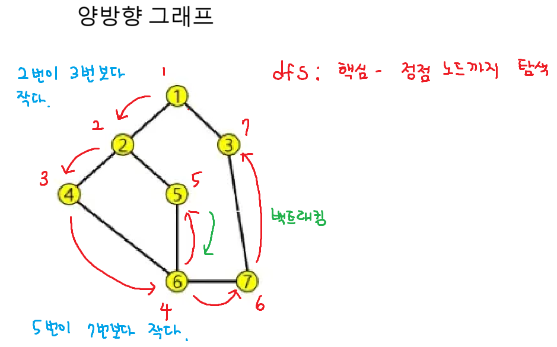
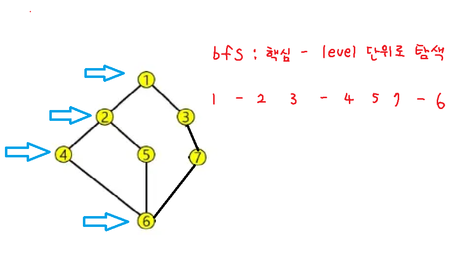
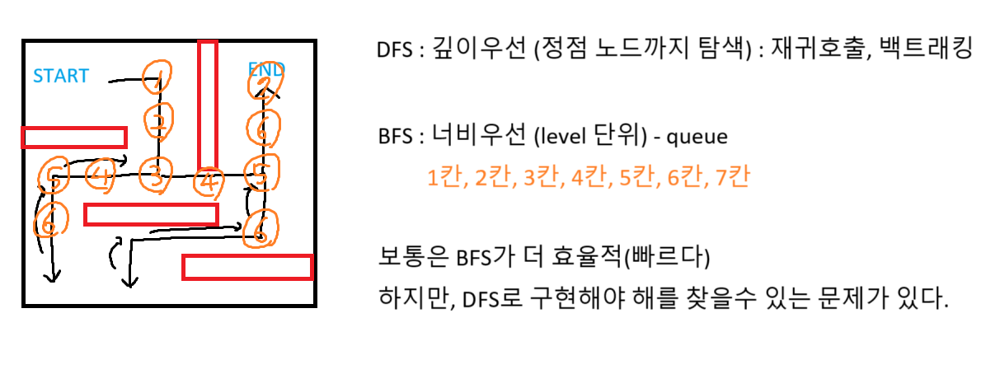

# dfs

# bfs

## dfs & bfs

# 1. 최소힙 2. 최대힙 3. 다중조건힙

# 최소힙
'''python
import heapq

pq = []

heapq.heappush(pq, 3)
heapq.heappush(pq, 1)
heapq.heappush(pq, 4)

while pq:
    print(heapq.heappop(pq)) # 1 3 4
'''

# 최대힙
'''python
import heapq

pq = []

heapq.heappush(pq, -3)
heapq.heappush(pq, -1)
heapq.heappush(pq, -4)

# 뺄 때는 다시 -를 붙여서 양수로 전환
while pq:
    print(-heapq.heappop(pq)) # 4 3 1
'''

# 다중조건 힙 -> 튜플로
'''python
import heapq

pq = []

heapq.heappush(pq, (2, 'A')) # 우선순위 1. 정수 2. 문자열
heapq.heappush(pq, (2, 'B'))
heapq.heappush(pq, (4, 'C'))

while pq:
    print(heapq.heappop(pq)) # (2, 'A') (2, 'B') (4, 'C')
'''