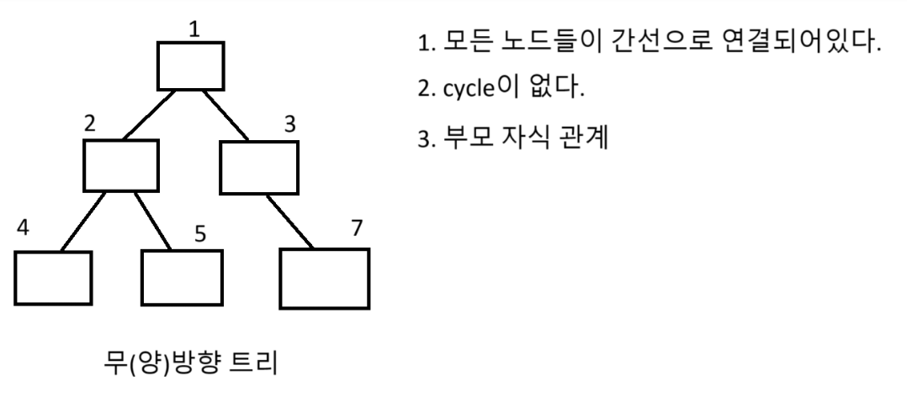
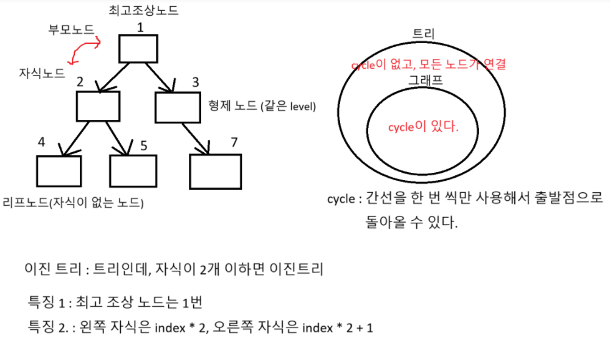

# tree



# 이진트리의 dfs 탐색


# 전위순회 (현재노드 -> 왼쪽자식노드 -> 오른쪽자식노드)
```python
bt = [0, 'A', 'B', 'T', 'R', 'S', 'V']
bt += [0] * 100

def dfs(now): # now는 현재노드
    # 전위순회를 하다가
    # 왼쪽자식으로 갔는데 8이다. 8번인덱스에는 노드가 없다. - return
    # 오른쪽자식으로 갔는데 9이다. 9번 인덱스에는 노드가 없다. - return
    # 13이야 잘못들어갔어 return
    if bt[now] == 0: return

    print(bt[now])# 현재 노드 먼저 방문
    dfs(now * 2) # 왼쪽 자식 노드 방문
    dfs(now * 2 + 1)# 오른쪽 자식 노드 방문

dfs(1)
```
# 중위순회 (왼쪽 자식 노드 -> 현재 노드 -> 오른쪽 자식 노드)
```python
bt = [0, 'A', 'B', 'T', 'R', 'S', 'V']
bt += [0] * 100

def dfs(now): # now는 현재노드

    if bt[now] == 0: return

    dfs(now * 2)  # 왼쪽 자식 노드 방문
    print(bt[now])# 현재 노드 먼저 방문
    dfs(now * 2 + 1)# 오른쪽 자식 노드 방문

dfs(1)
```
# 후위순회 (왼쪽 자식 노드 -> 오른쪽 자식 노드 -> 현재 노드)
```python
bt = [0, 'A', 'B', 'T', 'R', 'S', 'V']
bt += [0] * 100

def dfs(now): # now는 현재노드

    if bt[now] == 0: return

    dfs(now * 2)  # 왼쪽 자식 노드 방문
    dfs(now * 2 + 1)  # 오른쪽 자식 노드 방문
    print(bt[now])# 현재 노드 먼저 방문

dfs(1)
```

# BFS 탐색과정


# 인접 행렬
```python
MAP = [[0] * 7 for _ in range(7)]
MAP[0][1] = 1
MAP[0][2] = 1
MAP[1][3] = 1
MAP[2][4] = 1
MAP[4][5] = 1
MAP[4][6] = 1
print(MAP)
```

# 인접 리스트
```python

alist = list([] for _ in range(7))

alist[0] = [1, 2]
alist[1] = [3]
alist[2] = [4]
alist[4] = [5, 6]
from collections import deque
q = deque()
q.append(0) # start 지점

name = 'ABCDEFG'

while q:
    # 1. 큐에서 뺀다 (탐색)
    now = q[0] # now는 탐색하고잇는 현재노드
    q.popleft()
    print(name[now], end = ' ')

    # 2. 다음 갈 곳 예약 걸기(큐 등록)
    for i in range(len(alist[now])):
        next = alist[now][i] # 다음 탐색 할 곳
        q.append(next)
```