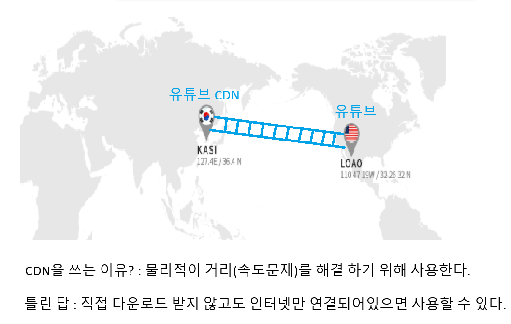

# CDN

분산 컨텐츠 네트워크

# 월말평가 서술형

## 1.스택

### 스택과 큐의 차이점

스택: 후입선출
큐: 선입선출

## 2.dfs(완전탐색, 백트래킹)

1 3 4 2(3번이 루트노드일 때 중위순회)

## 문제

t = int(input())

def string_reverse():
string = input().split('.')
arr = [list(i) for i in string]
arr2 = [list(reversed(i)) for i in arr]
arr3 = [''.join(i) for i in arr2]
return '.'.join(arr3)

for tc in range(1, t + 1): print(f'#{tc}', string_reverse())
