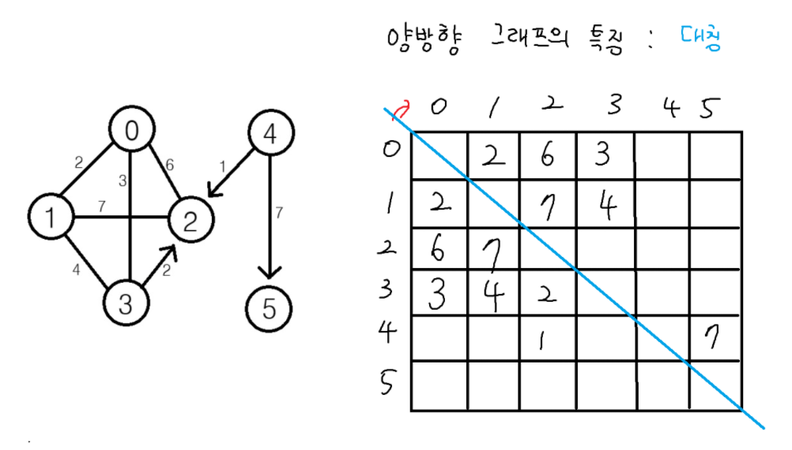

# 인접리스트


# 그래프, 트리 자료구조

구조: 그래프 / 트리
표현: 인접행렬 / 인접리스트 / 부모배열 / 포인터 방식 등


# 트리의 dfs


# 그래프의 dfs


## dfs 문제 예시1


## dfs 문제 예시2



### ① `used[now] = 1`을 **함수 시작 부분**에 두는 경우 (전형적인 DFS)

```python
def dfs(now):
    used[now] = 1      # 들어오자마자 방문 체크
    print(now)
    for i in range(4):
        if MAP[now][i] == 0: continue
        if used[i]: continue
        dfs(i)
```

- 장점:

  - `now`를 방문하자마자 바로 방문 처리해서,
    다른 경로에서 다시 들어오려 해도 막아줌 → **중복 방문 방지 확실**
  - DFS 표준 구현 방식

---

### ② `used[i] = 1`을 **재귀 호출 직전에 두는 경우** (지금 코드)

```python
def m_dfs(now):
    print(now)
    for i in range(4):
        if MAP[now][i] == 0: continue
        if used[i]: continue
        used[i] = 1     # 여기서 방문 체크
        m_dfs(i)
```

- 동작은 비슷하지만, 차이가 있음:

  - `now`는 함수 시작 시점에 **아직 방문 처리 안 된 상태**
  - 대신 `i`(다음 노드)는 **호출 직전에 방문 처리**
  - 즉, "부모가 자식을 방문하기 직전에 방문 처리"하는 구조

---

### ⚠️ 차이점

- **사이클이 있는 그래프에서** 두 방식이 다르게 동작할 수 있어요.

  - ① 방식은 `now`에 진입하자마자 방문 처리 → 자기 자신을 다시 재귀 호출하는 경우도 바로 차단됨.
  - ② 방식은 `now`를 아직 방문 처리 안 했으니, 자기 자신에게 간선이 있는 경우(`MAP[now][now] == 1`) 무한 루프에 빠질 수 있음.

---

✅ 결론:

- 지금 그래프에는 자기 자신으로 가는 간선이 없어서 두 방식이 사실상 같은 동작을 해요.
- 하지만 **안전하고 일반적인 DFS 구현은 ①번 방식** (함수 들어오자마자 `used[now] = 1`)이에요.

---

원해요? 제가 두 방식을 같은 그래프에서 실행해서 출력 결과 비교해드릴까요?
