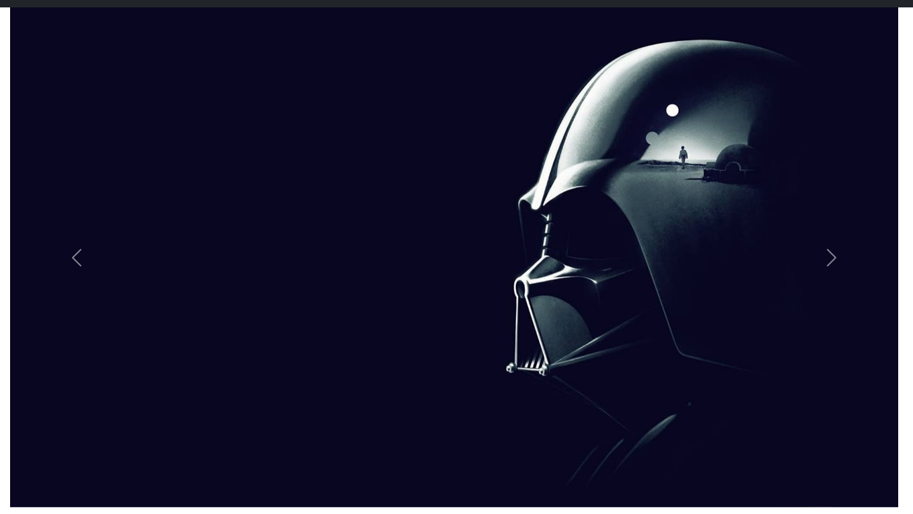
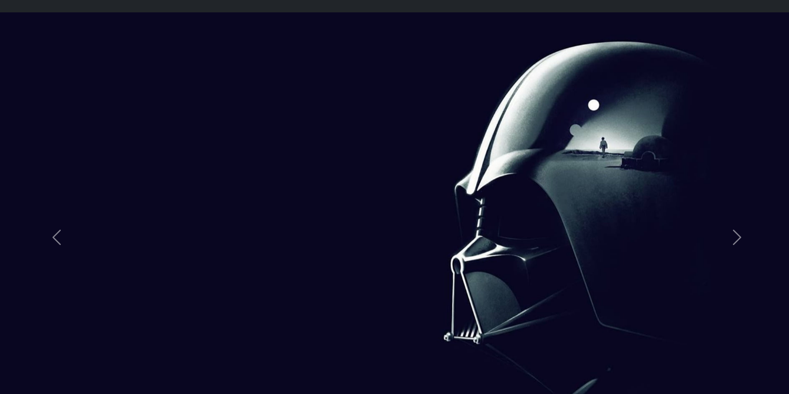
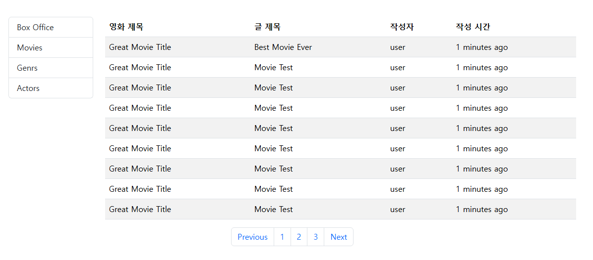

# F01

## 992px 이상

## 992px 미만

# F02

# F03

## 1400px 이상

## 1400px 미만

# F04, F05

## 992px 이상

## 992px 미만 768px 이상

## 768px 미만

# F06, F07, F08

## 992px 이상

## 992px 미만

llm 사용하지 않고 코드 구현했습니다.
아직은 사람이 꽃보다 아름다운 것 같다고 느꼈습니다.
