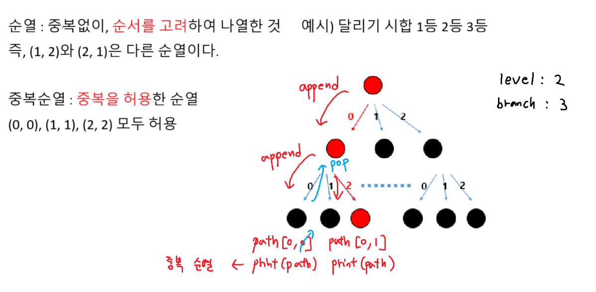
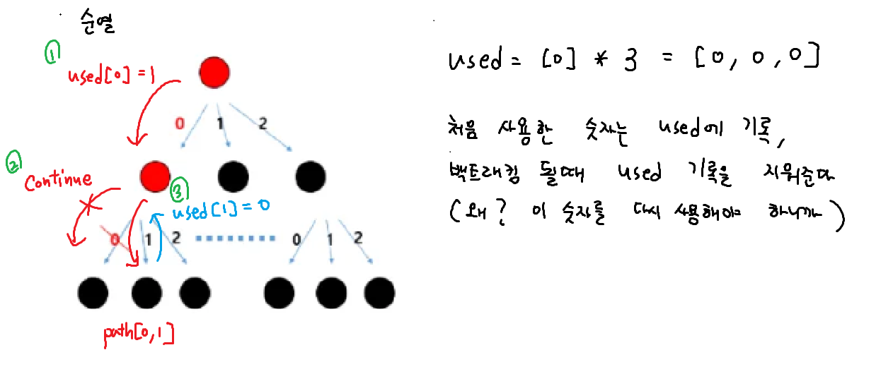
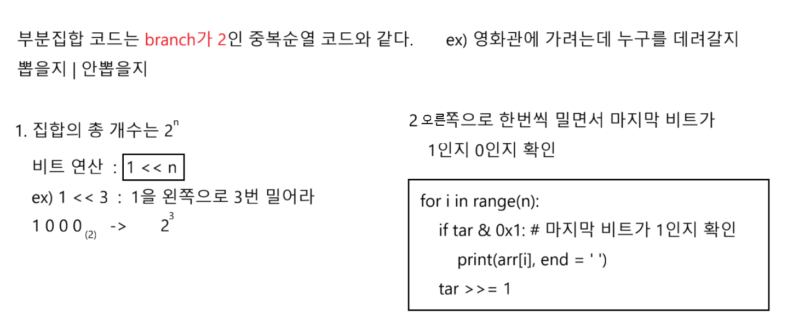
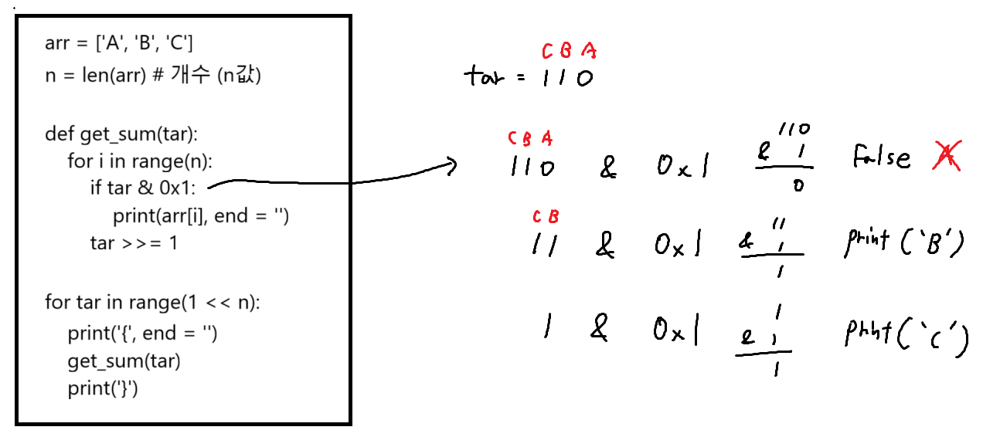

# 순열과 중복순열



.png>)

# 부분집합




# 조합

```python
# 5명중에 3명을 뽑는 조합 ( 순서를 고려하지 않는다 )
# ['A', 'B', 'C']와 ['C', 'B', 'A']는 같은 조합이다.
# 조합을 for문으로 구현

arr = ['A', 'B', 'C', 'D', 'E']

for a in range(5):
    start1 = a + 1
    # a에서 뽑은건 포함하면 안된다.
    for b in range(start1, 5): # branch가 최대 5
        start2 = b + 1
        # b에서 뽑은건 포함하면 안된다.
        for c in range(start2, 5): # branch가 최대 5
            print(arr[a], arr[b], arr[c])


# 조합 재귀호출 코드

arr = ['A', 'B', 'C', 'D', 'E']
path = []
n =  3 # 5명중에 3명을 뽑는다

def recur(lev, start):
    if lev == n: # level은 n(n명 뽑는다)
        print(*path)
        return

    for i in range(start, 5): # branch가 최대 5
        path.append(arr[i])
        recur(lev + 1, i + 1)
        path.pop()

recur(0, 0)
```
