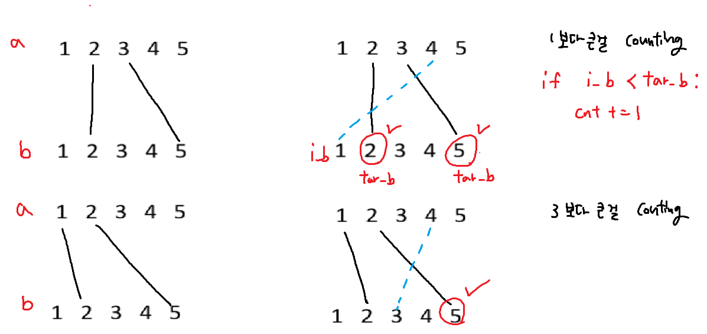
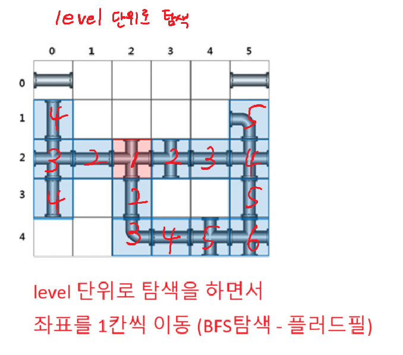
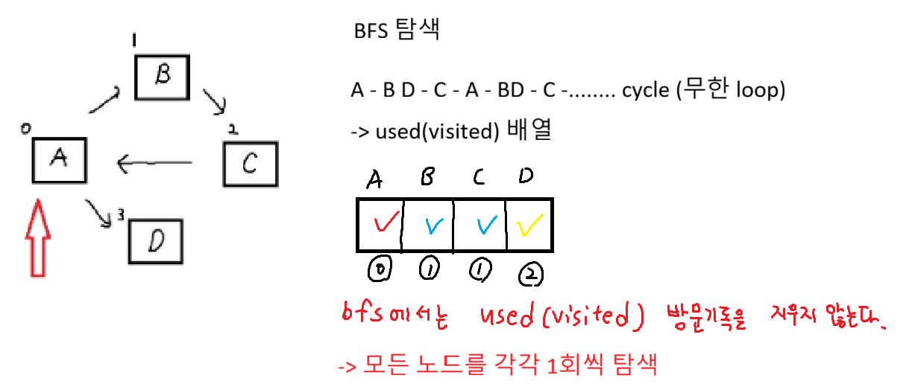

## 전봇대 문제 전략



## 탈주범 검거 문제 전략



```python
# 자료구조!
# pipe의 모든 경우 [상, 하, 좌, 우] -> 8개의 종류
pipe = [[0, 0, 0, 0], [1, 1, 1, 1], [1, 1, 0, 0], [0, 0, 1, 1], [1, 0, 0, 1 ], [0, 1, 0, 1], [0, 1, 1, 0], [1, 0, 1, 0]]
# 델타배열(방향배열) : 상 하 좌 우
dy, dx = [-1, 1, 0, 0], [0, 0, -1, 1]
# 다음칸으로 연결되는 파이프의 방향은 반대방향이어야 한다
# 상, 하, 좌, 우 : 0, 1, 2, 3
# 상 -> 하, 하 -> 상, 좌 -> 우, 우 -> 좌
opp = [1, 0, 3, 2]
```

# BFS 탐색 과정

```python
from collections import deque

alist = [[] for _ in range(7)]

alist[0] = [1, 2]
alist[1] = [3]
alist[2] = [4]
alist[4] = [5, 6]

q = deque()
q.append(0) # start지점

name = "ABCDEFG"

while q: # 큐가 빌때 까지 반복
    # 1. 큐에서 뺀다(탐색) - popleft()
    now = q[0]
    q.popleft()
    print(name[now], end = ' ')

    # 2. 다음 갈곳 예약 걸기(큐 등록) - append()
    for i in range(len(alist[now])):
        next = alist[now][i]
        q.append(next)

```


