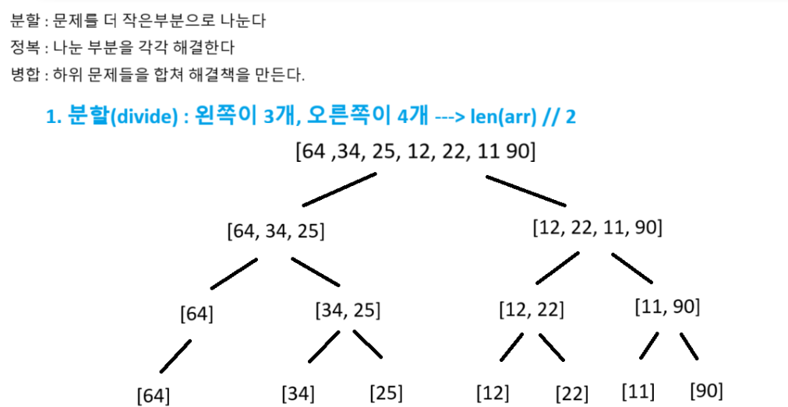
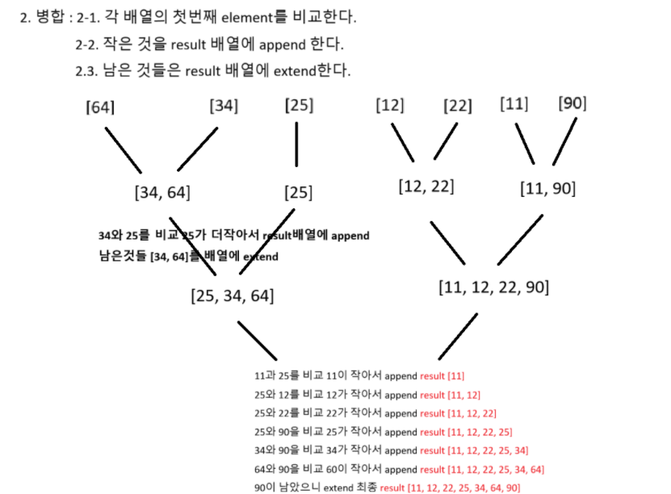
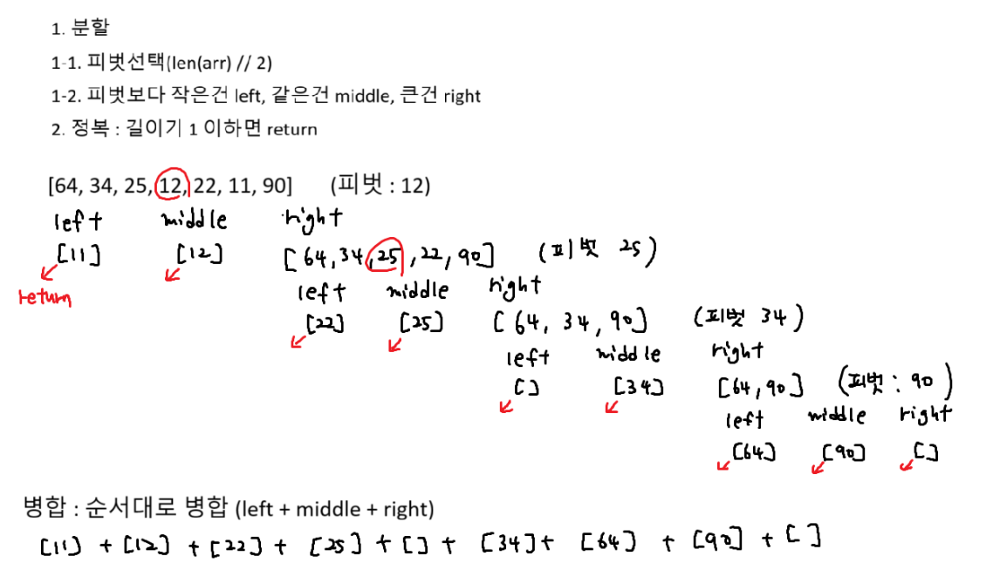
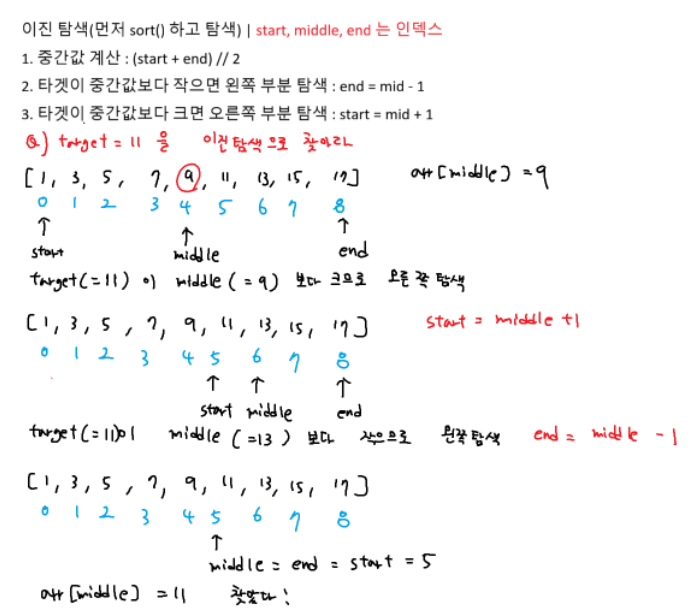

# 병합정렬




```python
# 병합 정렬 기본 코드
def merge_sort(arr):
    # 배열의 길이가 1이하면 이미 정렬이 끝났다
    if len(arr) <= 1:
        return arr
    # 배열을 반으로 나누기위한 인덱스
    mid = len(arr) // 2
    # 왼쪽 절반을 재귀적으로 정렬
    left = merge_sort(arr[:mid])
    # 오른쪽 절반을 재귀적으로 정렬
    right = merge_sort(arr[mid:])
    # 정렬된 왼쪽과 오른쪽 배열을 병합
    result = merge(left, right)

    return result

def merge(left, right):
    result = []
    i, j = 0, 0# i: 왼쪽, j: 오른쪽
    # 왼쪽과 오른쪽배열을 비교하면서 병합
    while i < len(left) and j < len(right):
        if left[i] <= right[j]:
            # 왼쪽 요소가 더 작으니까 result에 append
            result.append(left[i])
            i += 1 # element 이동(인덱스 이동)
        else:
            result.append(right[j])
            j += 1 # 그다음 element 이동
    # while문이 종료되면 남은것들 extend
    result.extend(left[i:])
    result.extend(right[j:])

    return result

# 예시 하드 코딩
arr = [64, 34, 25, 12, 22, 11, 90]
sorted_arr = merge_sort(arr)
print(*sorted_arr)
```

# 퀵정렬



```python
def quick_sort(arr):
    # 정복 : 배열의 길이가 1이하면 return
    if len(arr) <= 1: return arr

    # 피벗을 배열의 중간 요소로 선택
    pivot = arr[len(arr) // 2]
    # 피벗보다 작은 요소들은 left 리스트에 담음
    left = [x for x in arr if x < pivot]
    # 피벗과 같은 요소들은 middle 리스트에 담음
    middle = [x for x in arr if x == pivot]
    # 피벗보다 큰 요소들은 right 리스트에 담음
    right = [x for x in arr if x > pivot]

    # 재귀 호출
    result = quick_sort(left) + middle + quick_sort(right)

    return result

arr = [64, 34, 25, 12, 22, 11, 90]
sorted_arr = quick_sort(arr)
print(*sorted_arr)
```

# 이진탐색



```python
def binary_search(arr, target):
    start = 0
    end = len(arr) - 1

    while start <= end: # start와 end가 같아질때까지
        mid = (start + end) // 2
        # 이진 탐색을 통해서 타겟을 찾으면 middle 인덱스 반환
        if arr[mid] == target:
            return mid
        # 타겟이 중간값 보다 크면 오른쪽 부분 탐색
        elif arr[mid] < target:
            start = mid + 1
        else: # 타겟이 중간값보다 작으면 왼쪽 부분 탐색
            end = mid - 1
    # 타겟 못찾으면
    return -1

arr = [1, 3, 5, 7, 9, 11 ,13, 15, 17]
target = 11
result = binary_search(arr, target)
print(f'target index : {result}')
```
