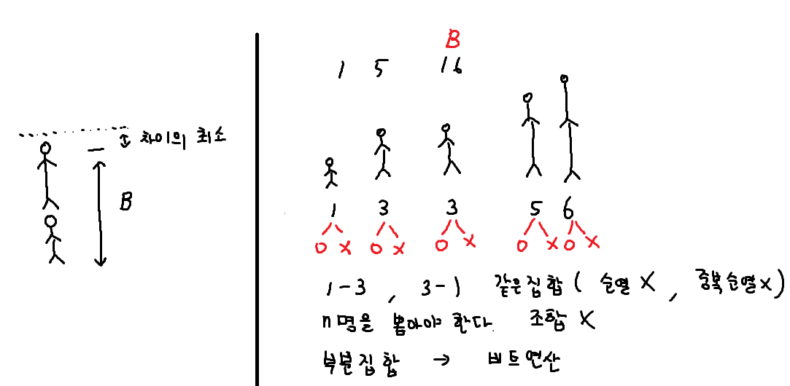
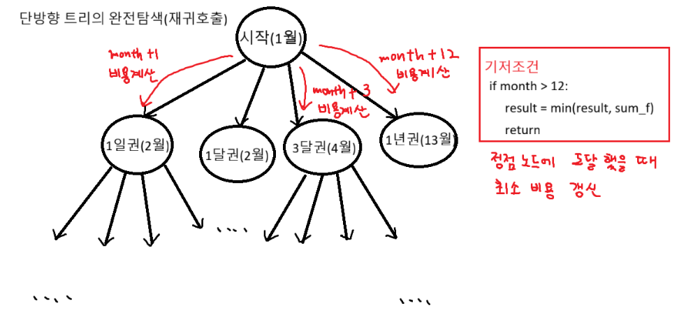
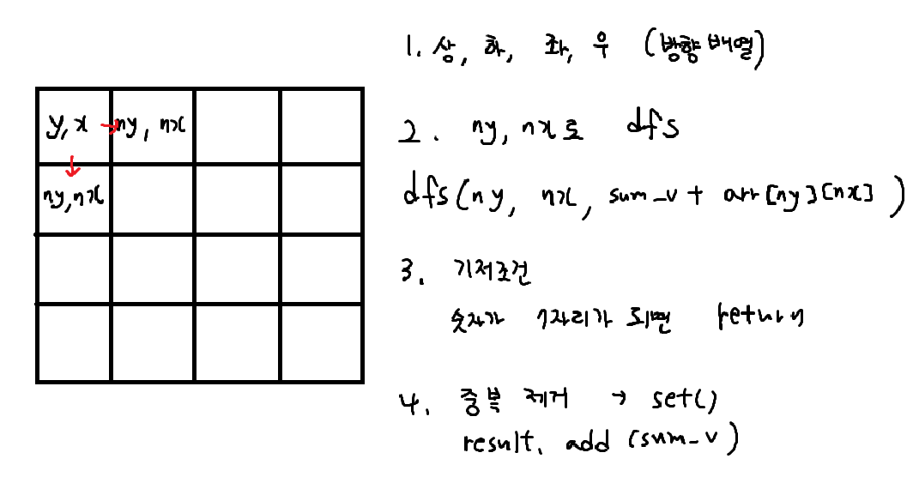

# 장훈이의 높은 선반



```python
# 1. 부분집합 핵심 로직 : 비트연산

for i in range(N):
    if tar & 0x1: # 마지막 비트가 1인지 확인
        sum_v += heights[i]
    tar >>= 1 # target을 오른쪽으로 밀면서

# 우리가 구하려는건 높이의 최소값 X -> 차이의 최소값
diff = sum_v - B
```

<br>

# 수영장



<br>

# 격자판의 숫자 이어 붙이기


