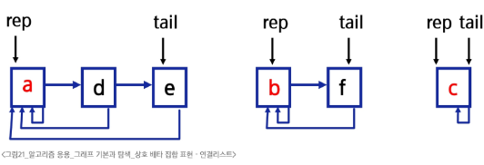
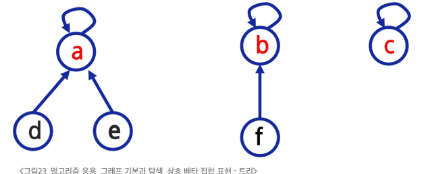

# 그래프

아이템(사물 또는 추상적 개념)들과 이들 사이의 연결 관계를 표현
선형 자료구조나 트리 구조로 표현하기 어려운 N:N 관계를 가지는 원소들을 표현하기에 용이

- 정점(vertex)들의 집합과 이들을 연결하는 간선(edge)들의 집합으로 구성된 자료 구조
  - |V|: 정점의 개수, |E|: 그래프에 포함된 간선의 개수라 할 때,  
    |V|개의 정점을 가지는 그래프는 최대 |E| = |V| \* (|V| - 1)/2개의 간선을 가질 수 있다.
  - 예) 5개 정점이 있는 그래프의 최대 간선 수는 10(= 5 \* 4 / 2)개이다.

## 그래프 유형

- 완전 그래프: 정점들에 대해 가능한 모든 간선들을 가진 그래프  
  
- 부분 그래프: 원래 그래프에서 일부의 정점이나 간선을 제외한 그래프

## 인접 정점

- 인접
  - 두 개의 정점에 간선이 존재하면 인접해 있다고 한다.
  - 완전 그래프에 속한 임의의 두 정점들은 모두 인접해 있다.

## 그래프 경로

- 경로란 간선들을 순서대로 나열한 것
- 경로 중 한 정점을 최대한 한번만 지나는 경로를 단순경로라고 함
- 시작한 정점에서 끝나는 경로를 사이클이라고 함

## 그래프 표현

- 간선의 정보를 저장하는 방식, 메모리나 성능을 고려해서 결정
- 인접 행렬
  - 2차원 배열을 이용해서 간선 정보를 저장
- 인점 리스트
  - 각 정점마다 해당 정점과 인접한 정점 정보를 저장
- 간선의 배열
  - 간선을 배열에 연속적으로 저장

### 인접 리스트

- 각 정점에 대한 인접 정점들을 순차적으로 표현
- 하나의 정점에 대한 인접 정접들을 각각 노드로 하는 연결 리스트로 저장
  
  
  

### 인접 행렬

- N \* N 정방 행렬
- 행 번호와 열 번호는 그래프의 정점에 대응
- 두 정점이 인접되어 있으면 1, 그렇지 않으면 0으로 표현
- 장점: 쉽다. 특정연결 검색이 빠르다.
- 단점: 메모리 낭비 (정점 수에 비해 간선 수가 적은 경우 공간 낭비가 심함)
- 무향 그래프

  - i번째 행의 합 = i번째 열의 합 = Ni의 차수

  

- 유향 그래프

  - 행 i의 합 = Ni의 진출 차수
  - 열 i의 합 = Ni의 진입 차수

  

# DFS(Depth First Search, 깊이 우선 탐색)

- 경로 출력
- 강 수 있는 경로의 수

## 중복 검사가 필요없는 DFS

- 스택에 push된 정점을 visited에 표시

## stack VS 재귀호출

- 재귀호출
  - 장점: 구현이 쉽다
  - 단점: 느림, 재귀 깊이 제한
- stack
  - 장점: 빠르다
  - 단점: 구현이 어렵다

# BFS(Bteadth first Search, 너비 우선 탐색)

- 몇 번만에 가는지?
- 최단 거리?

# Union-Find(Disjoint set)

- 공통 원소가 없는 집합
  - 교집합이 없는 집합들
- 대표자
  - 각 집합을 대표하는 하나의 원소
- 상호 배타 집합
  - 확률, 논리 집합론에서 동시에 일어날 수 없는 경우, 공통이 없는 경우를 말함
  - 집합론에서는 서로 소와 같은 뜻으로 사용됨
- 표현 방법
  - 연결리스트로 표현할 수 있음
  - 트리를 이용해 표현할 수 있음

## 서로 소 집합 연선

- Make-Set(x): 유일한 멤버 x를 포함하는 새로운 집합을 생성하는 연산
  - x를 원소로 가진 집합을 만듦
- Find-Set(x): x를 포함하는 집합을 찾는 연산
  - x가 속한 집합의 대표 원소를 반환함
- Union(x, y): x와 y를 포함하는 두 집합을 통합하는 연산
  - y가 속한 집합과 x가 속한 집합의 힙집합을 만듦
  - x가 합집합의 대표원소가 됨

## 상호 배타 집합 표현 - 연결리스트

- 같은 집합의 원소들은 하나의 연결리스트로 관리
- 연결리스트의 맨 앞의 원소가 집합의 대표 원소
- 각 원소는 집합의 대표원소를 가리키는 링크를 가짐

## 상호 배타 집합 표현 - 트리

- 하나의 집합을 하나의 트리로 표현함
- 자식 노드가 부모 노드를 가리키며 루트 노드가 대표자가 됨

## 상호 배타 집합에 대한 연산 문제점

- 편향 트리가 되는 경우 Find-Set()에 시간이 오래 걸림
- Find-set()에서 찾아진 대표 원소로 각 원소의 대표원소를 바꾸면 경로가 단축됨

## 연산의 효율을 높이는 방법

- Rank를 이용한 Union
  - 각 노드는 자신을 루트로 하는 subtree의 높이를 랭크라는 이름으로 저장함
  - 두 집합을 합칠 때 랭크가 낮은 집합을 랭크가 높은 집합에 붙임

- Path compression
  - Find-Set을 행하는 과정에서 만나는 모든 노드들이 직접 root를 가리키도록 포인터를 바꿔줌

**union-find를 혼자 사용하는 경우는 거의 없다.**

- 다른 알고리즘 + union-find
- 그래프의 사이클 탐지(union-find 활용)
