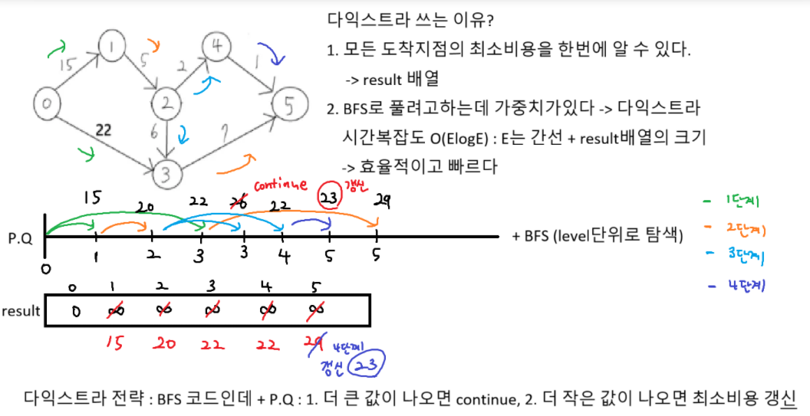

## 크루스칼, 프림

특정한 상황에서 프림이 좀 더 빠름

# 다익스트라



```python
import heapq

MAP = [[0] * 6 for _ in range(6)]
MAP[0][1] = 15
MAP[0][3] = 22
MAP[1][2] = 5
MAP[2][3] = 6
MAP[2][4] = 2
MAP[3][5] = 7
MAP[4][5] = 1

def dijkstra(start):
    n = len(MAP) # 노드의 개수 6개
    result = [float('inf')] * n
    result[start] = 0 # 시작 노드
    # PQ 초기화
    q = [(0, start)] # 비용, 노드

    while q: # PQ가 빌때까지 반복
        # 1. 힙에서 뺀다(탐색)
        price, now = heapq.heappop(q) # 최소 비용

        if result[now] < price: continue # 더 큰값 나오면 continue

        # 2. 다음 갈곳 예약 걸기(힙 등록)
        for i in range(n):
            if MAP[now][i] == 0: continue
            next_price = MAP[now][i] # 다음 노드까지 비용
            price_sum = price + next_price # 비용이 누적
            if result[i] > price_sum: # 더 작은 비용 나오면 갱신
                result[i] = price_sum
                # 힙등록 price_sum은 시작노드부터 i번 노드까지
                heapq.heappush(q, (price_sum, i))

    return result

result = dijkstra(0) # start가 0번노드
print(*result)
```
